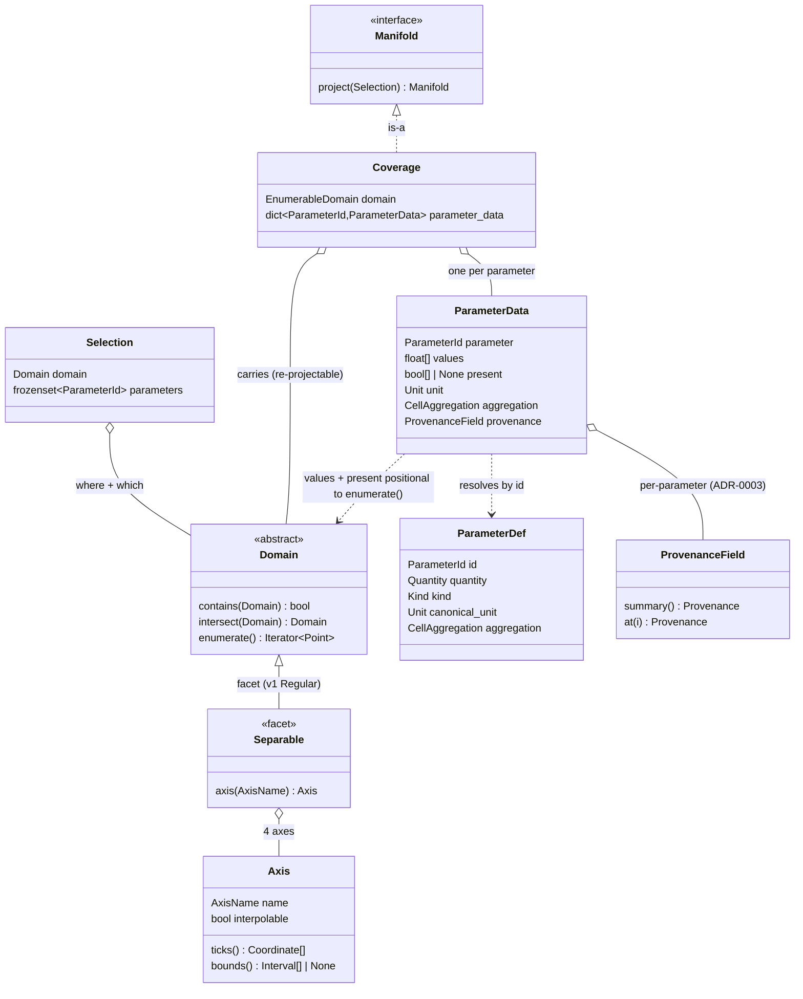

# Data model — domains, coverages, parameters

The concrete encoding of everything that flows through the [algebra](./0001-manifold-algebra-and-composition.md):
the **`Domain` / `Selection`** (the *where*), the **`Coverage` / `ParameterData`** (the data), and the
**parameter** itself (the *what* — quantity, aggregation, extent). It records the encoding so v1's
concrete types can be built with the right **slots reserved**, even where v1 fills only the degenerate
case. The provenance attribute a `ParameterData` carries is owned by
[ADR-0003](./0003-provenance-and-origin.md); how producers are matched and resolved is
[ADR-0004](./0004-producer-resolution-and-capability.md).

## The shape

## Domain & Selection

- **`Domain` is an interface; representations vary behind it.** A `Domain` is an abstract coordinate set
  over the **4 axes** (3 spatial + `valid_time`) with a fixed operation
  surface — `contains` / `intersect` (the Capability filter), cardinality + enumerability,
  enumerate / index, and a sample-onto seam — and **nothing in that surface assumes the axes are
  separable**. v1 ships one representation; the interface admits richer ones with no contract change:
  - **`RegularDomain`** — origin + step + count per axis (the uniform lattice).
  - **`RectilinearDomain`** — explicit per-axis ticks (separable but irregular).
  - **`CurvilinearDomain`** — non-separable geometry (radar geotangent slice, satellite swath).
    *Room left, not built* ([#12](../concerns.md#12-curvilinear-domains)).

- **Separability and regularity are facets, not the base type.** Mirroring the algebra's *capabilities,
  not subtypes*: per-axis decomposition is an optional facet a **separable** representation exposes (its
  per-axis `Axis` with `ticks` / `bounds`), and the regular **anchor + step** descriptor is a facet a
  **regular** representation exposes. Curvilinear domains satisfy the base interface without either.
  **Only a regular representation can be snapped-to.**

- **Mode is the Domain's shape, not a separate field** — `region` / `snapped` / `exact` are *which kind
  of Domain* you built, so **`Selection = Domain + parameters`** (no redundant `mode` field that could
  disagree with the Domain):
  - **Continuous** (`region`) — bounds, no discretization → projects to a **field**.
  - **Snapped** — regular **step** fixed, anchor / extent open → resolvable against a declared grid.
  - **Enumerable** (`exact`) — concrete coordinate set (regular-anchored or irregular point set) →
    `Countable` result.

- **One regular descriptor unifies snapped / declared-grid / exact.** A regular lattice is
  `{anchor, step, extent}`; its members differ only in which parts are fixed — **Snapped** fixes `step`
  (+ request bounds), a **declared grid** fixes `anchor + step` (extent open), an **exact** lattice
  fixes all three. So a declared grid is just the **anchored-regular member** — **provider-exact where a
  vendor declares a lattice, a configured guess for point vendors that expose none** — and the read-back
  resolution `snapped → exact = step(request) ⊕ anchor(grid) ⊕ bounds(request)` keeps **`bounds(request)`**.
- **Grid alignment is per-`Countable` node, and splits into two opposite-extent steps.** A `Countable`
  `Reservoir`'s `Store` **`quantize`s** a request for **retention** — snaps the requested axes onto the
  declared grid **and widens the extent outward to whole assimilable units**, so the retrieval shape
  **encloses** the request (extent **≥** request; the rounding is the store lattice's own business). At
  **read** the `Reservoir` **homogenizes** the stored cells back onto the requested `Domain` — extent
  **=** request (`snapped → exact` above) — so `project(sel)` always returns a Coverage on `sel.domain`
  ([ADR-0001](./0001-manifold-algebra-and-composition.md)). Resolving to the caller's exact output is the
  **read-back, not the `Store`'s job**; the two steps move extent in **opposite directions** (quantize
  widens past the request, read-back crops back to it). The per-axis snap is `quantize`'s internal
  mechanism (no standalone operation): an open-anchor regular axis borrows the grid's anchor (the
  `valid_time` case), a **concrete coordinate snaps to its nearest grid node** (the lat/lon case);
  `issue_time` is not requested, so it is never snapped. A request's **mode** (Snapped vs Enumerable) may
  be resolved at the edge, but **internal nodes are handed enumerable (store-shaped) Selections**, never
  Snapped. The canonical lattice is **emergent per node**; there is no global lattice config.

- **`issue_time` is a provenance stamp, not a Domain axis.** The per-Coverage / per-request `Domain`
  has **4 interpolable axes** (3 spatial + `valid_time`); `issue_time` (the forecast issuance a value
  came from) is **never interpolated, never snapped, never in a request**, so it is **not** a coordinate
  the caller navigates — it is **run identity carried on the atomic `Origin`**
  ([ADR-0003](./0003-provenance-and-origin.md)) and the basis of freshness (run currency).
  **Interpolability** therefore describes every Domain axis uniformly (all 4 interpolable); **no
  categorical axis sits in the core**. The **categorical-key mechanism** (select / group, never
  interpolate) survives as a **collection-layer seam** — the home of `issue_time` *archives* and future
  **ensemble / scenario** keys — not a core field axis. **Cross-run combination** is then a **reconciler
  folding run-stamped contributor Coverages along `valid_time`**
  ([ADR-0004](./0004-producer-resolution-and-capability.md)), yielding a synthetic origin — *not* an
  axis to interpolate.

- **Sampling onto an interpolable axis is kind-dependent** (see *Parameters* below): for an **intensive**
  quantity it interpolates to any requested tick; for an **extensive** quantity, resampling along time is
  **re-aggregation** — exact only for phase-aligned coarsening, otherwise unserved. The matching rule
  lives with Capability ([ADR-0004](./0004-producer-resolution-and-capability.md)); the *kernel choice*
  per interpolable axis stays deferred ([#5](../concerns.md#5-read-time-homogenization-fidelity)).

## Coverage & ParameterData

- **A Coverage carries its Domain; values are positional to it.** `Coverage = (EnumerableDomain,
  {parameter: ParameterData})` — the Coverage *contains* the one `EnumerableDomain` (so it is a
  re-projectable `Manifold`), and `values[i]` is the value at the i-th `Point` of `domain.enumerate()`.
  **No coordinates are duplicated** in a `ParameterData` ("a Coverage is a Selection filled with data,"
  literally); in-memory packing (N-D vs flat, dtype, order) is deliberately unspecified. The
  per-parameter element is **`ParameterData`**, not "range" — that reads as an interval, colliding with
  the axis `bounds`.

- **`unit` and `aggregation` are cloned by value onto `ParameterData`.** Both are canonical,
  parameter-determined facts whose **source of truth is `ParameterDef`**, carried by value (beside
  `values`, `present`, `provenance`) so a stored / serialized Coverage is **self-describing without** the
  parameter registry — the same by-value treatment ADR-0003 gives `provenance`. They share one home; we
  do not split them.

- **Nodata is an explicit per-parameter mask.** `present: Sequence[bool] | None`, positional to
  `values`: `present[i] is False` ⇒ **nodata** at that point (a *successful* gap — 0 contributors, not a
  fault, [ADR-0004](./0004-producer-resolution-and-capability.md)); `present is None` ⇒ all cells
  present (the elided common case). An explicit boolean mask — **not** a NaN sentinel — because it is
  dtype-agnostic (categorical / integer parameters can't carry NaN) and keeps "no data" distinct from a
  legitimate not-a-number value. Per-parameter, since each parameter's coverage footprint differs.

- **Extent → an optional `bounds` facet on the Domain axis.** Each axis coordinate *may* carry an
  `Interval`; `bounds() is None` ⇒ the coordinate is an **instant / point**, positionally aligned to
  `ticks()`. It generalizes to all axes uniformly (a spatial cell is the product of per-axis intervals).
  `bounds` lives on the **`Separable` facet**, not the base `Domain` (non-separable per-cell extents are
  the deferred curvilinear case). So the aggregation **interval** for `values[i]` is the shared
  `valid_time` axis `bounds()[i]` — stated **once** on the Domain, read by every parameter.

- **Provenance is a `ProvenanceField` slot, owned by [ADR-0003](./0003-provenance-and-origin.md).** Each
  `ParameterData` carries one whose O(1) `summary` is the parameter-level handle; v1 builds only the
  `Uniform` representation.

## Parameters — quantity, aggregation, extent

- **Quantity is the identity root, carrying a `kind`.** A parameter's identity root is a physical field
  — its **quantity** — whose **`kind ∈ {intensive, extensive}`** is its relationship to a cell's
  temporal extent (extent-scaling), and sets which aggregations are meaningful:
  - **Intensive** — instantaneous, **extent-independent** (temperature, rain-rate, pressure, wind).
    Window statistics apply; **extent optional**.
  - **Extensive** — **additive**, the value is the **integral over the cell extent** (precipitation,
    snowfall, radiant energy). **Extent required**; values sum across adjacent cells.
  `kind` is *extent-scaling*, not a units claim: rain-rate `mm/hr` carries a time unit yet is intensive
  (window-independent); precip `mm` carries none yet is extensive (3h > 1h).

- **The two cell axes, split by dimension.** Cell aggregation is two independent things:
  - **`CellAggregation = point | max | min | mean`** — a **window statistic**, *dimension-preserving*
    (mean temp is K, peak intensity is mm/hr); lives on `ParameterDef`, cloned onto `ParameterData`;
    `point` is the degenerate window (an instant). The Provider's Normalizer coerces vendor data to the
    canonical aggregation, so it is not a freely-chosen runtime value.
  - **Calculus depth** — *dimension-changing* (`∫ rate dt → accumulation`, `mm/hr·h → mm`); this is the
    quantity `kind`, **not** a `CellAggregation` value. Accumulation is the **integration edge** between
    an intensive `rate` quantity and its extensive integral (e.g. rain-rate ↔ precipitation) — a
    vocabulary-declared quantity pair, not a third kind.

- **Extent never enters the parameter key.** Extent is the Domain's `valid_time` `bounds` (above). So the
  **materialized / requested parameter key = `(quantity, aggregation)`**; "3h precipitation" = parameter
  `precipitation` over a Domain whose `valid_time` cells are 3h wide — one shared axis serving parameters
  of different temporal meaning.

- **A parameter is a functional `agg(quantity)`; requests name it explicitly.** The window statistic +
  quantity form the key; the **extent is requested through the Selection's `valid_time` cells**, never in
  the parameter name. Ergonomic **aliases** (e.g. `precip_3h`) are **surface sugar** that desugars at the
  edge into *(parameter `(precipitation, ·)`, valid_time cells = 3h)* — the on-ramp to later formula
  injection, **not** a second identity. v1's surface accepts a bare quantity name = `point(quantity)`.

- **An extensive quantity's extent is producer-intrinsic.** Unlike an intensive quantity (resampleable
  to any tick), an extensive quantity has a native extent (period + phase) only coarsenable by aligned
  additivity. That native extent is a **per-parameter Capability fact**
  ([ADR-0004](./0004-producer-resolution-and-capability.md)), carried by the `Store`'s declared grid and
  the returned Coverage's `valid_time` `bounds`. A request for an unreachable extent (1h from a 3h
  producer, a shifted phase, instants) is simply **`capability-mismatch`** — no disaggregation machinery.

## Why

- One Domain interface with swappable representations keeps the common case (a uniform hourly lattice)
  trivial while leaving curvilinear radar reachable without reshaping consumers — the Arbiter's fold,
  homogenization, and serialization bind to the interface, not a representation.
- Folding mode into the Domain removes a redundant field and makes illegal states unrepresentable; the
  single regular descriptor collapses request-snap / store-grid / exact-lattice into one parameterized
  shape, so snapping is an algebraic combine, not special-case code.
- Putting **extent on the Domain** keeps coordinates in one place and lets a single shared axis serve
  parameters of different temporal meaning; carrying `unit` / `aggregation` by value keeps a Coverage
  self-describing, which the stateless-Provider / store-and-flow model needs.
- **Quantity-as-root + `kind`** explains *why precipitation differs from temperature* — extent-scaling
  (integration depth), not a special enum value — and keeps units honest (the dimension change rides the
  quantity edge, not a cell attribute). Splitting the cell axes stops `sum` masquerading as a peer of
  `max` / `min`: a statistic and an integral are categorically different and per-level exclusive over a
  single extent ("daily max of hourly accumulation" is a two-window calculator chain).
- An explicit `present` mask makes partial coverage representable from day one without retrofitting the
  value layout when the first partial producer or coverage reconciler lands.

## Considered options

- **Keep `mode` as an explicit `Selection` field.** Rejected: it restates the Domain shape and the two
  can disagree (a snapped flag on an irregular point set). *(Reversible as a derived accessor.)*
- **A single separable (per-axis product) Domain as the base type.** Rejected: bakes separability into
  the contract, excluding curvilinear geometries; separability is a facet.
- **Keep `issue_time` as a 5th (categorical) axis.** Rejected (**reversed** — earlier accepted): it is
  never interpolated, snapped, or requested, so it is a **phantom axis** that double-accounts with the
  provenance run stamp. The earlier fear that demotion makes **cross-run / forecast-convergence
  inexpressible** does not hold — cross-run is a **reconciler over run-stamped contributors**
  ([ADR-0004](./0004-producer-resolution-and-capability.md)) and convergence is a **derived enumerable
  view** over those contributors; both are expressible with `issue_time` as a stamp. The categorical-key
  shape survives as a **collection-layer seam** (archives, ensemble, scenario). *(Reversible: restore the
  axis if a native 2-D `valid_time × issue_time` Coverage is ever wanted.)*
- **A single per-parameter `cell_method` carrying both aggregation and extent.** Rejected: duplicates the
  extent into every `ParameterData` and can disagree with the Domain — split extent (Domain) from
  aggregation (parameter).
- **`unit` cloned but `aggregation` reference-only (or vice versa).** Rejected: same kind of canonical,
  parameter-determined fact — asymmetry would make a Coverage partially self-describing. Both cloned.
- **NaN sentinel for nodata.** Rejected: only works for float-valued data and conflates "no data" with a
  legitimate not-a-number value.
- **A literal `CellIntegration` peer enum beside `CellAggregation`.** Rejected: integration is
  dimension-changing and per-level-exclusive with window statistics, so it is truer as the quantity
  `kind` than a per-cell attribute.
- **Extent in the parameter key — `agg(quantity, extent)`.** Rejected: the Domain already owns extent;
  putting it in the key too makes "extent" sayable in two places that can disagree. Aliases give the
  ergonomic bundling without the second source of truth.
- **Aggregation not part of identity (one quantity, many cell-methods at read).** Rejected for the
  *materialized key* — `max(temp)` and `mean(temp)` must coexist in one Coverage — but reconciled: the
  **identity root** is the quantity, the **materialized key** is `(quantity, aggregation)`.

## Consequences

- The **materialized key is `(quantity, aggregation)`**: "instantaneous temperature" and "daily-max
  temperature" sit at different keys, not one parameter with two cell-methods.
- **Mixed *periods* of one parameter in one Coverage are not yet representable** — `precipitation` over
  1h vs 3h `valid_time` cells would need different bounds for the same coordinate (a future
  **per-parameter `bounds` override** seam). An extent/Domain matter, not identity; v1's precipitation is
  **uniformly hourly** (one shared `valid_time` extent serves every parameter), so the override is deferred.
- The aggregation vocabulary and canonical quantity set are the deferred **parameter conventions**
  ([#10](../concerns.md#10-parameter-conventions)); this ADR fixes the *structure* (quantity identity,
  `kind`, the cell axes), while the concrete quantity table, conversion edges, and their quality costs
  stay deferred (#10, [#7](../concerns.md#7-quality-scoring)).
- **Curvilinear domains** and the **sampling-kernel choice** remain interface promises / edge-deferred
  ([#12](../concerns.md#12-curvilinear-domains), [#5](../concerns.md#5-read-time-homogenization-fidelity)).
- **The model degenerates cleanly.** Unfilled slots — `present = None`, `Uniform` provenance, windowed
  `CellAggregation` (`max` / `min` / `mean`), the per-parameter `bounds` override, `PerPoint` — cost
  nothing, so each is purely additive. v1's concrete positions on these slots (including precipitation as
  the one `extensive` parameter) live in [`v1-requirements.md`](../v1-requirements.md).
