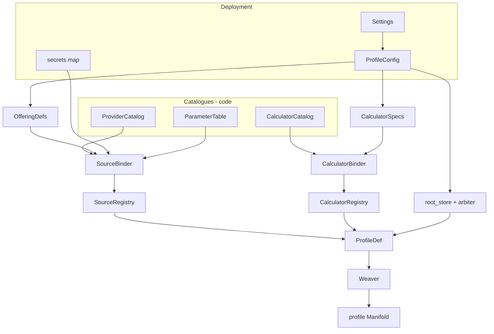
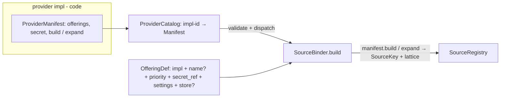
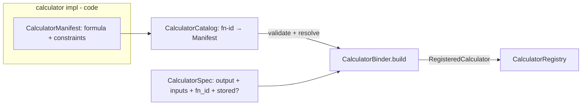
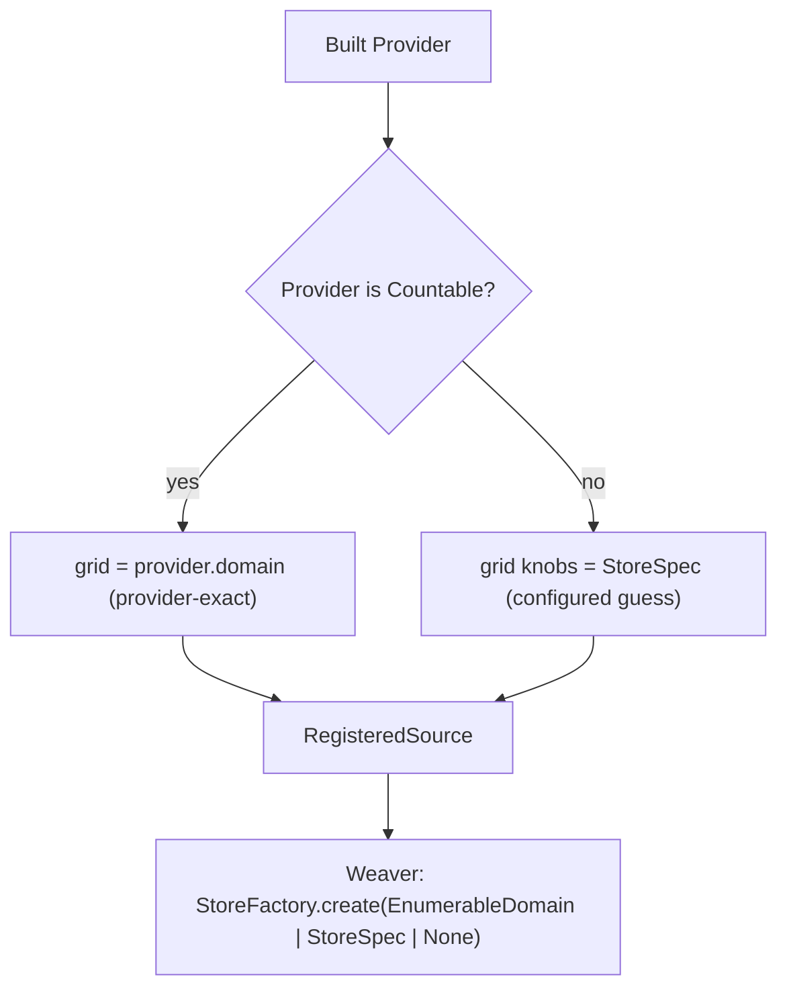

# Build-time composition

Meteoscape separates deployment input, process-wide plugin catalogues, profile recipes, constructed
bindings, and the runtime DAG. This keeps operator choices declarative, plugin declarations coupled to
their construction code, and all graph omniscience out of request-time nodes.

## Decision

### Composition flow

### Plugin binding

### Source-store binding

Profile-root uses the same `StoreSpec` shape (`ProfileConfig` / `ProfileDef`) — a separate *instance*, never the same singleton as a Source store. `OfferingSpec.default_lattice` (a prebuilt `EnumerableDomain`) is retired; declared grids are built by the factory (issue 006).

- **Catalogues are process-wide code maps.** `ParameterTable` defines canonical parameters;
  `ProviderCatalog` maps implementation ids to cohesive provider manifests; `CalculatorCatalog` maps
  function ids to cohesive calculator manifests. A plugin manifest keeps immutable declarations and
  its construction operation together: offerings and `build` / `expand` for a provider; formula and
  declarative invocation constraints for a calculator. These are code references and build
  declarations, not live graph nodes or request-path data flow.
- **`ProfileConfig` is operator input for one served profile.** It contains offering enablement
  tickets (`OfferingDef`s), calculator recipes (`CalculatorSpec`s), root-store binding, and Arbiter
  policy. Enablement refers to catalogue entries; it does not duplicate plugin declarations, carry
  live instances, or author `SourceKey`.
- **Two symmetrical binders produce weave inputs.**
  `SourceBinder(ProviderCatalog).build(OfferingDef…)` → `SourceRegistry` (live providers + priority +
  source lattice; needs secrets/clock).
  `CalculatorBinder(CalculatorCatalog).build(CalculatorSpec…)` → `CalculatorRegistry`
  (`RegisteredCalculator`: resolved manifest + inputs + `stored?`, keyed by output). Bindings are
  catalog-resolved recipes — **not** Calculator instances (those need scoped Arbiters at weave).
- **`ProfileDef` holds two registries + profile knobs.** `SourceRegistry` + `CalculatorRegistry` +
  root-store + arbiter. Both sides are build products; neither side still carries raw catalogue tickets.
  The composition root assembles `ProfileDef`; the binders do not.
- **Weaver owns graph construction only.** `Weaver(stores: StoreFactory).weave(ProfileDef)`
  allocates source and profile-root Stores via `stores.create(lattice | None)`, builds the Source map
  (`SourceKey → Reservoir(store, Provider)`), and constructs
  `Arbiter(sources, SourceRegistry, ArbiterPolicy)` under the best-view `Reservoir`. It does not hold
  a catalogue, resolve `fn_id`, or interpret `priority` — ranking is the Arbiter's reconciler
  ([ADR-0004](./0004-producer-resolution-and-capability.md)). Calculator construction / scoped Arbiters
  land with issue 002b. Runtime nodes hold fixed children and perform no catalogue lookup.
  **`CompositionError`** is the build-time failure category (binders + unsupported Arbiter policy);
  it is distinct from the request-path taxonomy in `errors.py`.
- **Catalogue is an architectural role, not a directory rule.** The `parameters` leaf holds only
  parameter vocabulary (identity types + `ParameterId` constants) below `manifold/`. Every injected
  catalogue — `ParameterTable`, `ProviderCatalog`, `CalculatorCatalog` — lives in `nodes/catalog/`
  above `manifold/`, because their faces refer to algebra and node contracts.

## Consequences

- A plugin's declarations and construction operation change as one unit, while SourceBinder /
  CalculatorBinder / Weaver remain generic dispatchers.
- Factory names match: binder → registry-product on both sides.
- `ProfileDef` is symmetrical: two resolved registries, not live providers beside unevaluated specs.
- Source-store lattices and the profile-root lattice remain distinct build inputs.
- `ProfileDef` is a constrained composition language over the fixed node family, not a free-form DAG
  description.
- Catalogue entries may carry typed algebra constraints without creating a dependency cycle in the
  parameter-vocabulary leaf.

## Rejected alternatives

- **Stores arriving live in the registries / `ProfileDef`.** Symmetry with the live `Provider` on
  `RegisteredSource` is superficial: a Provider is a stateless *input*, a `Store` is a stateful *graph
  position*. Live stores would make `ProfileDef` single-use (weave-twice would share retention state),
  and a stored Calculator's store can only be weave-allocated (the node it wraps is built inside
  `weave`), which would split allocation into two models. The Weaver allocates every store via an
  injected `StoreFactory` (`create(EnumerableDomain | StoreSpec | None) → Store`; today returns
  `StubStore`); the Weaver
  owns **where** stores exist, never **what** a store is.
- **`ProfileDef` carrying `CalculatorSpec`s beside a live `SourceRegistry`.** Mixes tickets with
  build products; calculator catalogue resolution then hides inside Weaver.
- **`CalculatorRegistry` as live Calculators.** Calculator construction needs the candidate index and
  scoped Arbiters; that is weave, not binding.
- **Asymmetric factory names (`Registry` vs `CalculatorBinder`).** Obscures the peer relationship;
  both factories are binders.
- **Separate declaration and builder maps keyed by the same string.** This permits offering,
  capability, secret, constraint, and identifier drift between independently registered halves. A
  coupled registration mechanism could enforce consistency, but adds a second abstraction without a
  current need.
- **Put catalogues in the vocabulary leaf.** Catalogue faces refer to contracts above the parameter
  leaf (`EnumerableDomain`, `Provider`); binding them below `manifold/` would invert dependencies or
  force hollow duplicate descriptors. The leaf keeps vocabulary only; catalogues sit in `nodes/catalog/`.
- **Let a binder own plugin-specific construction.** This makes the binder aware of every vendor and
  calculator instead of dispatching through deep plugin modules.
- **Use one store configuration for sources and the served root.** Rejected as *sharing one
  instance*; accepted as *one `StoreSpec` shape*. A source grid is provider-exact or a per-source
  `StoreSpec` guess; the profile root is a separate `StoreSpec` instance (operator-selected).
- **Pass operator config directly into runtime nodes.** Construction resolves config into fixed,
  typed graph objects before the request path.
