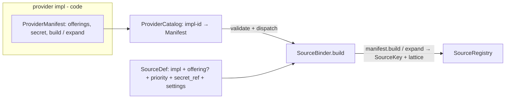
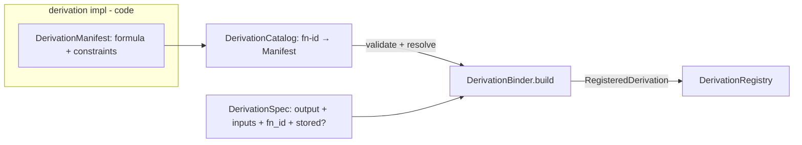
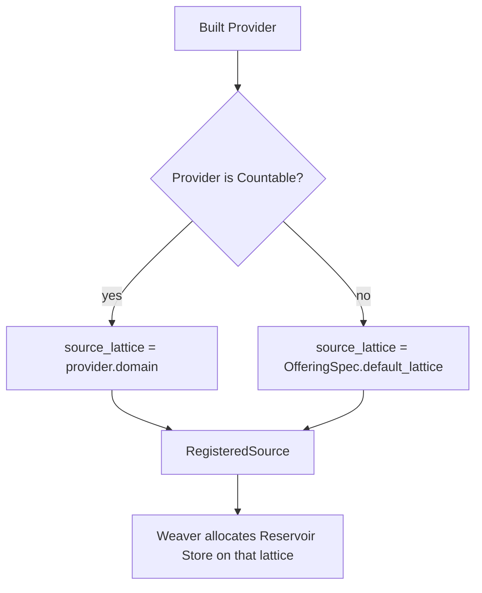

# Build-time composition

Meteoscape separates deployment input, process-wide plugin catalogues, profile recipes, constructed
bindings, and the runtime DAG. This keeps operator choices declarative, plugin declarations coupled to
their construction code, and all graph omniscience out of request-time nodes.

## Decision

### Composition flow

### Plugin binding

### Source-store lattice binding

Profile-root lattice is separate (`ProfileConfig` / `ProfileDef.root_store`) — never the same singleton as Source lattices.

- **Catalogues are process-wide code maps.** `ParameterTable` defines canonical parameters;
  `ProviderCatalog` maps implementation ids to cohesive provider manifests; `DerivationCatalog` maps
  function ids to cohesive derivation manifests. A plugin manifest keeps immutable declarations and
  its construction operation together: offerings and `build` / `expand` for a provider; formula and
  declarative invocation constraints for a derivation. These are code references and build
  declarations, not live graph nodes or request-path data flow.
- **`ProfileConfig` is operator input for one served profile.** It contains source enablement tickets,
  derivation recipes, root-store binding, and Arbiter policy. Enablement refers to catalogue entries;
  it does not duplicate plugin declarations, carry live instances, or author `SourceKey`.
- **Two symmetrical binders produce weave inputs.**
  `SourceBinder(ProviderCatalog).build(SourceDef…)` → `SourceRegistry` (live providers + priority +
  source lattice; needs secrets/clock).
  `DerivationBinder(DerivationCatalog).build(DerivationSpec…)` → `DerivationRegistry`
  (`RegisteredDerivation`: resolved manifest + inputs + `stored?`, keyed by output). Bindings are
  catalog-resolved recipes — **not** Calculator instances (those need scoped Arbiters at weave).
- **`ProfileDef` holds two registries + profile knobs.** `SourceRegistry` + `DerivationRegistry` +
  root-store + arbiter. Both sides are build products; neither side still carries raw catalogue tickets.
  The composition root assembles `ProfileDef`; the binders do not.
- **Weaver owns graph construction only.** `weave(ProfileDef)` constructs Calculators and scoped
  Arbiters from the derivation registry, allocates source and profile-root Stores, and returns the
  served root. It does not hold a catalogue or resolve `fn_id`. Runtime nodes hold fixed children and
  perform no catalogue lookup. Calculator topology and memoization remain defined by
  [ADR-0004](./0004-producer-resolution-and-capability.md).
- **Catalogue is an architectural role, not a directory rule.** The `parameters` leaf holds only
  parameter vocabulary (identity types + `ParameterId` constants) below `manifold/`. Every injected
  catalogue — `ParameterTable`, `ProviderCatalog`, `DerivationCatalog` — lives in `nodes/catalog/`
  above `manifold/`, because their faces refer to algebra and node contracts.

## Consequences

- A plugin's declarations and construction operation change as one unit, while SourceBinder /
  DerivationBinder / Weaver remain generic dispatchers.
- Factory names match: binder → registry-product on both sides.
- `ProfileDef` is symmetrical: two resolved registries, not live providers beside unevaluated specs.
- Source-store lattices and the profile-root lattice remain distinct build inputs.
- `ProfileDef` is a constrained composition language over the fixed node family, not a free-form DAG
  description.
- Catalogue entries may carry typed algebra constraints without creating a dependency cycle in the
  parameter-vocabulary leaf.

## Rejected alternatives

- **`ProfileDef` carrying `DerivationSpec`s beside a live `SourceRegistry`.** Mixes tickets with
  build products; derivation catalogue resolution then hides inside Weaver.
- **`DerivationRegistry` as live Calculators.** Calculator construction needs the candidate index and
  scoped Arbiters; that is weave, not binding.
- **Asymmetric factory names (`Registry` vs `DerivationBinder`).** Obscures the peer relationship;
  both factories are binders.
- **Separate declaration and builder maps keyed by the same string.** This permits offering,
  capability, secret, constraint, and identifier drift between independently registered halves. A
  coupled registration mechanism could enforce consistency, but adds a second abstraction without a
  current need.
- **Put catalogues in the vocabulary leaf.** Catalogue faces refer to contracts above the parameter
  leaf (`EnumerableDomain`, `Provider`); binding them below `manifold/` would invert dependencies or
  force hollow duplicate descriptors. The leaf keeps vocabulary only; catalogues sit in `nodes/catalog/`.
- **Let a binder own plugin-specific construction.** This makes the binder aware of every vendor and
  derivation instead of dispatching through deep plugin modules.
- **Use one store configuration for sources and the served root.** A source lattice is
  provider-exact or an offering default; the profile root is an operator-selected best-view lattice.
- **Pass operator config directly into runtime nodes.** Construction resolves config into fixed,
  typed graph objects before the request path.
