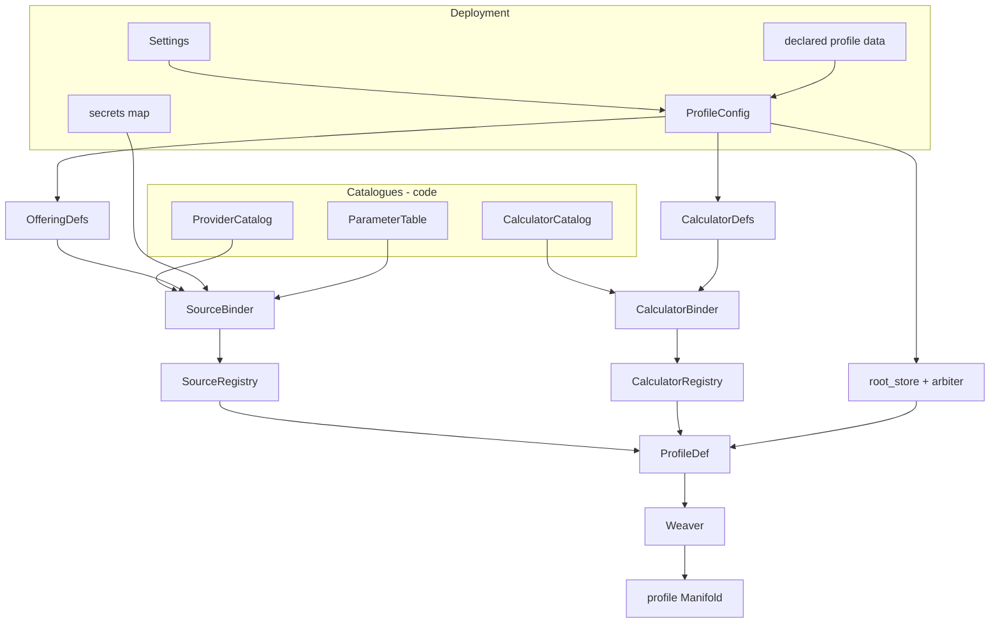
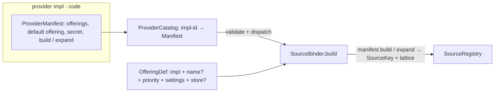
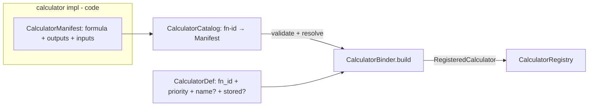
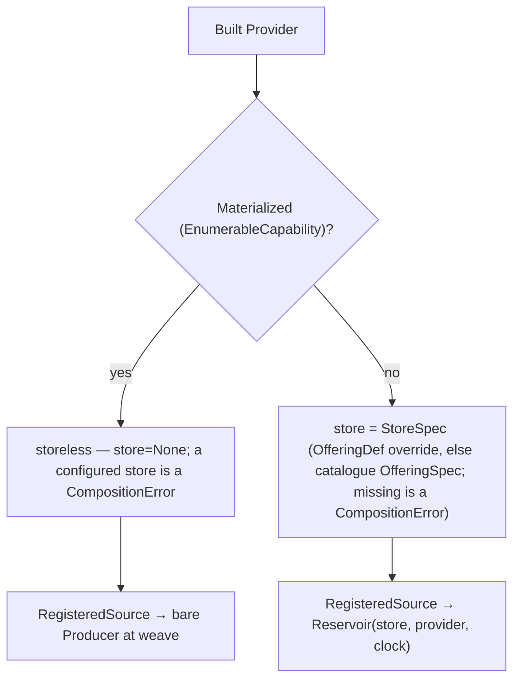

# Build-time composition

Meteoscape separates deployment input, process-wide plugin catalogues, profile recipes, constructed
bindings, and the runtime DAG. This keeps operator choices declarative, plugin declarations coupled to
their construction code, and all graph omniscience out of request-time nodes.

## Decision

### Composition flow

```mermaid
flowchart TB
  subgraph catalogues [Catalogues - code]
    PC[ProviderCatalog]
    CC[CalculatorCatalog]
    PT[ParameterTable]
  end
  subgraph deploy [Deployment]
    Sec[secrets map]
    Settings --> PC0[ProfileConfig]
    Decl[declared profile data] --> PC0
  end
  PC0 --> OD[OfferingDefs]
  PC0 --> CS[CalculatorDefs]
  PC0 --> RS[root_store + arbiter]
  PC --> SB[SourceBinder]
  OD --> SB
  Sec --> SB
  PT --> SB
  SB --> SR[SourceRegistry]
  CC --> CB[CalculatorBinder]
  CS --> CB
  CB --> CR[CalculatorRegistry]
  SR --> PD[ProfileDef]
  CR --> PD
  RS --> PD
  PD --> Weaver
  Weaver --> M[profile Manifold]
```

*Amended 2026-08-19 (0123 align):* `ProfileConfig` is assembled **at the composition root** from a
module-level profile declaration beside the catalogues plus `Settings`' knobs; `Settings` alone no
longer projects it, and there is no global default profile — each root declares its own. The
secrets map is keyed by `impl_id` and filled by reading the env names each declared `SecretSlot`
derives (`secrets_from_env` in config; `secret_slots` over the catalogue) — a lookup, never a
namespace sweep, and a non-env caller supplies the same map directly. **A declared keyed offering with an unfilled slot refuses the boot** (`CompositionError`)
— no boot-degrade mechanism. Vendor-specific profile declarations (a keyed primary) are deployment
attachments at the embedding edge, never the shipped root's shape. **A def selects and ranks; it
never restates a manifest's declarations** — the calculator I/O group is `CalculatorManifest`'s
row (as `OfferingSpec` is the provider's); the builtin modules export id constants as profile
handles (defs stay plain strings) and `priority` defaults to `0` — safe because the `priority`
reconciler resolves equal priorities by bind order (stable sort, its standing contract;
[ADR-0004](./0004-producer-resolution-and-capability.md)); a weave-time tie refusal was built and
removed 2026-08-19 as contradicting that contract
→ [config/secrets ticket](../tickets/done/01-0123-config-secrets-degrade.md).

### Plugin binding

```mermaid
flowchart LR
  subgraph impl [provider impl - code]
    M["ProviderManifest: offerings, default offering, secret, build / expand"]
  end
  CAT["ProviderCatalog: impl-id → Manifest"]
  OD["OfferingDef: impl + name? + priority + settings + store?"]
  M --> CAT
  CAT -->|validate + dispatch| SB[SourceBinder.build]
  OD --> SB
  SB -->|"manifest.build / expand → SourceKey + lattice"| PR[SourceRegistry]
```

```mermaid
flowchart LR
  subgraph cimpl [calculator impl - code]
    CM["CalculatorManifest: formula + outputs + inputs"]
  end
  CCAT["CalculatorCatalog: fn-id → Manifest"]
  CSpec["CalculatorDef: fn_id + priority + name? + stored?"]
  CM --> CCAT
  CCAT -->|validate + resolve| CB[CalculatorBinder.build]
  CSpec --> CB
  CB -->|"RegisteredCalculator"| CR[CalculatorRegistry]
```

### Source-store binding

```mermaid
flowchart TD
  P[Built Provider] --> C{"Materialized (EnumerableCapability)?"}
  C -->|yes| N["storeless — store=None; a configured store is a CompositionError"]
  C -->|no| G["store = StoreSpec (OfferingDef override, else catalogue OfferingSpec; missing is a CompositionError)"]
  N --> S["RegisteredSource → bare Producer at weave"]
  G --> S2["RegisteredSource → Reservoir(store, provider, clock)"]
```

Profile-root uses the same `StoreSpec` shape (`ProfileConfig` / `ProfileDef`) — a separate *instance*, never the same singleton as a Source store. `OfferingSpec.default_lattice` (a prebuilt `EnumerableDomain`) is excluded; a `StoreSpec` is the only store-provisioning input ([ADR-0006](./0006-materialization-granularity-and-store-shape.md) closed the provider-lattice channel), and a prebuilt domain on the catalogue would reopen it.

- **Catalogues are process-wide code maps.** `ParameterTable` defines canonical parameters;
  `ProviderCatalog` maps implementation ids to cohesive provider manifests; `CalculatorCatalog` maps
  function ids to cohesive calculator manifests. A plugin manifest keeps immutable declarations and
  its construction operation together: offerings and `build` / `expand` for a provider; formula and
  declarative invocation constraints for a calculator. These are code references and build
  declarations, not live graph nodes or request-path data flow.
- **`ProfileConfig` is operator input for one served profile.** It contains offering enablement
  declarations (`OfferingDef`s), calculator enablements (`CalculatorDef`s), root-store binding, and Arbiter
  policy. Enablement refers to catalogue entries; it does not duplicate plugin declarations, carry
  live instances, or author `SourceKey`.
- **Vendor defaults are plugin-side; core config carries no vendor knowledge.** A
  manifest may declare its **`default_offering`**; an `OfferingDef` with `name=None` resolves to it
  at the binder, falling through to `expand` only when the manifest declares no default. Vendor
  policy defaults (a polling cadence, say) are `build`'s — the fallback it applies when the opaque
  `OfferingDef.settings` mapping omits the key. The core config layer carries only enablement
  plumbing — which impls are enabled, priorities, secret material (`settings` are declared on the
  def at a composition root, never spelled through env) —
  and never imports a vendor module: a plugin can register a manifest but cannot extend `Settings`,
  so any vendor default or vocabulary in core config forecloses out-of-tree providers
  ([#26](../concerns.md#26-provider--calculator-plugin-scaffolding)). The enforcing invariant and
  its guard live in the provider edge record ([edge/provider.md](../edge/provider.md)).
- **Two symmetrical binders produce weave inputs.**
  `SourceBinder(ProviderCatalog).build(OfferingDef…)` → `SourceRegistry` (live providers + priority +
  source store knobs; needs secrets/clock), keyed by **`SourceKey (provider, dataset)`**.
  `CalculatorBinder(CalculatorCatalog).build(CalculatorDef…, parameters)` → `CalculatorRegistry`
  (`RegisteredCalculator`: resolved manifest + **resolved output `ParameterDef`s** + input ids + priority +
  `stored?`), keyed by **`CalculatorKey (method, name)`** — the calculator peer of `SourceKey`
  (`method` = `fn_id`, `name` = the configured variant, binder-defaulted to `"default"` when omitted).
  The binder takes a `ParameterTable` (mirroring `SourceBinder`'s injected deps) to resolve each output
  `ParameterId` to the `ParameterDef` the Calculator's `DerivedCapability` and output `Coverage` need, so
  the **Weaver stays vocabulary-free**. **Both registries are keyed by their
  `ProducerKey`, both carry `priority`** — so two calculators serving the same output by different methods
  are distinct producers the reconciler ranks, exactly as two providers competing for one parameter.
  `CalculatorDef` is the calculator peer of `OfferingDef` (`fn_id ↔ impl`, `name`, `priority`). Bindings
  are catalog-resolved recipes — **not** Calculator instances (those need scoped Arbiters at weave).
- **`ProfileDef` holds two registries + profile knobs.** `SourceRegistry` + `CalculatorRegistry` +
  root-store + arbiter. Both sides are build products; neither side still carries raw catalogue declarations.
  The composition root assembles `ProfileDef`; the binders do not.
- **Weaver owns graph construction only.** `Weaver(stores: StoreFactory, clock: Clock).weave(ProfileDef)`
  allocates source and profile-root Stores via `stores.create(spec, deferred)`, builds each source node
  (`wire_source` → `Reservoir(store, Provider, clock)`) and each calculator node (memoized per output
  group, each with a scoped Arbiter; a stored Calculator wraps `Reservoir(store, calc, clock)`), and
  **wraps both kinds as `Producer{node, key}`** — one uniform candidate list. It constructs the
  **`Reconciler`** via `build_reconciler(ArbiterPolicy, SourceRegistry, CalculatorRegistry)` (which
  flattens both registries' `priority` recipe fields into the reconciler's `ProducerKey → int` lookup) and
  builds `Arbiter(producers, reconciler)` under the best-view `Reservoir(store, arbiter, clock)`. The
  `Clock` is build-time injection, and **one instance by construction**: `compose` takes the clock and
  builds the `StoreFactory` from it. Each `Reservoir`
  clocks its freshness gate; the store stays clockless on its contract face. It does not
  hold a catalogue, resolve `fn_id`, or **interpret** `priority` — it *invokes the reconciler factory*
  and orders nothing; ranking is the reconciler ([ADR-0004](./0004-producer-resolution-and-capability.md)).
  The two binders / registries stay distinct (different construction inputs); the Weaver is where both
  converge into `Producer`s. Runtime nodes hold fixed children and perform no catalogue lookup.
  **`CompositionError`** is the build-time failure category (binders + unsupported Arbiter policy);
  it is distinct from the request-path taxonomy in `errors.py`.
- **Catalogue is an architectural role, not a directory rule.** The `parameters` leaf holds only
  parameter vocabulary (identity types + `ParameterId` constants) below `manifold/`. Every injected
  catalogue — `ParameterTable`, `ProviderCatalog`, `CalculatorCatalog` — lives in `nodes/catalog/`
  above `manifold/`, because their faces refer to algebra and node contracts.

## Consequences

- A plugin's declarations and construction operation change as one unit, while SourceBinder /
  CalculatorBinder / Weaver remain generic dispatchers.
- Factory names match: binder → registry-product on both sides.
- `ProfileDef` is symmetrical: two resolved registries, not live providers beside unevaluated specs.
- Source-store lattices and the profile-root lattice remain distinct build inputs.
- `ProfileDef` is a constrained composition language over the fixed node family, not a free-form DAG
  description.
- Catalogue entries may carry typed algebra constraints without creating a dependency cycle in the
  parameter-vocabulary leaf.

## Rejected alternatives

- **Stores arriving live in the registries / `ProfileDef`.** Symmetry with the live `Provider` on
  `RegisteredSource` is superficial: a Provider is a stateless *input*, a `Store` is a stateful *graph
  position*. Live stores would make `ProfileDef` single-use (weave-twice would share retention state),
  and a stored Calculator's store can only be weave-allocated (the node it wraps is built inside
  `weave`), which would split allocation into two models. The Weaver allocates every store via an
  injected `StoreFactory` (`create(StoreSpec, deferred axes) → Store`); the Weaver
  owns **where** stores exist, never **what** a store is.
- **`ProfileDef` carrying `CalculatorDef`s beside a live `SourceRegistry`.** Mixes declarations with
  build products; calculator catalogue resolution then hides inside Weaver.
- **`CalculatorRegistry` as live Calculators.** Calculator construction needs the candidate index and
  scoped Arbiters; that is weave, not binding.
- **Asymmetric factory names (`Registry` vs `CalculatorBinder`).** Obscures the peer relationship;
  both factories are binders.
- **Separate declaration and builder maps keyed by the same string.** This permits offering,
  capability, secret, constraint, and identifier drift between independently registered halves. A
  coupled registration mechanism could enforce consistency, but adds a second abstraction without a
  demonstrated architectural need.
- **Put catalogues in the vocabulary leaf.** Catalogue faces refer to contracts above the parameter
  leaf (`EnumerableDomain`, `Provider`); binding them below `manifold/` would invert dependencies or
  force hollow duplicate descriptors. The leaf keeps vocabulary only; catalogues sit in `nodes/catalog/`.
- **Let a binder own plugin-specific construction.** This makes the binder aware of every vendor and
  calculator instead of dispatching through deep plugin modules.
- **Use one store configuration for sources and the served root.** Rejected as *sharing one
  instance*; accepted as *one `StoreSpec` shape*. A source grid is a per-source
  `StoreSpec`; the profile root is a separate `StoreSpec` instance (operator-selected).
- **Pass operator config directly into runtime nodes.** Construction resolves config into fixed,
  typed graph objects before the request path.
