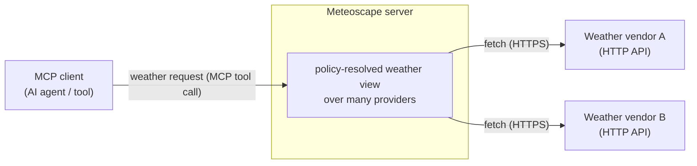
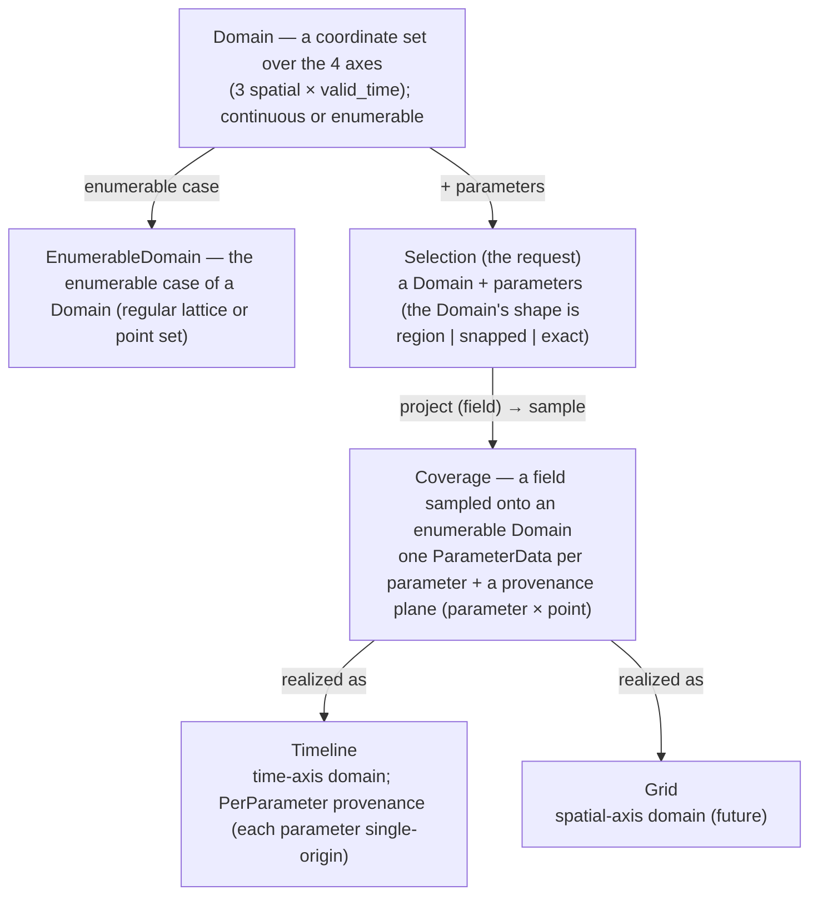
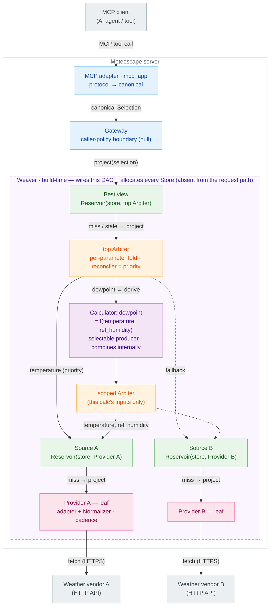

# Meteoscape · Architecture

This document captures the **high-level architecture**. See [`glossary.md`](./glossary.md) for the glossary, [`docs/adr/`](./adr) for recorded decisions, [`concerns.md`](./concerns.md) for standing concerns. Lower-level concerns are intentionally **deferred** and listed at the end.

> Scope note: everything here is at the architecture/contract level. Where a concrete shape would prematurely lock a deferred decision, we define only the *seam*.
> A fact the design depends on belongs here, but its justification goes to ADRs.
> ADRs are not carved in stone — this is a constantly-evolving project. A recorded rejection must state the real structural load it bears; flag arbitrary rejections rather than treat them as binding.
---

## Purpose

**Meteoscape** is a **manifold-based Coverage-resolution engine**: a recursive **Manifold** algebra that resolves a request for a field — weather over an area and time — into one normalized, provenance-stamped **Coverage** under a stated **policy/objective**. The hard problems it owns — **vendor heterogeneity** (different shapes, units, geometries), **source selection/quality**, and **freshness** — are resolved *inside* the algebra, behind one small, uniform contract, surfaced via MCP first (other surfaces later). **v1 ships a single objective — the *best view* (best-obtainable source + fallback) over timeline provider data** — but selection is **one policy of the engine, not its definition** (the same algebra generalizes to other objectives — see [Guiding principles](#guiding-principles) and [Extension points](#extension-points)).

## Scope / non-scope

**In scope (v1 builds):** — concrete v1 positions and build scope in [`v1-requirements.md`](./v1-requirements.md).

- The v1 **best view** profile — a single best-quality `Coverage` assembled over multiple providers behind one contract (one *objective*; the engine admits others).
- The **MCP surface** as the first adapter (protocol ↔ canonical).
- **Select + fallback** arbitration with implicit-priority quality (select, never combine). The Arbiter carries the **`reconciler` slot** from [ADR-0004](./adr/0004-producer-resolution-and-capability.md), but v1 ships **only** the default `priority` reconciler (= selection); `tile` / `consensus` / `feather` are wired-but-unbuilt extension points, so "never combine" is a v1 *configuration*, not a structural limit.
- The **canonical Coverage model** (Timeline realization) with **per-parameter provenance** and `expiration`-based freshness.
- The **`Store` type** as a wired-in seam (a `Writable`, `Countable` Manifold).

**Non-scope (by design, not just "later"):**

- **Not a weather model** — it serves provider data; it does not generate forecasts/NWP. (Derived calculators are a *synthetic Manifold* seam — v1 uses it for wind speed/direction over u/v — but producing primary forecasts is not the product.)
- **Not an accounts/billing business** — Meteoscape is not a multi-tenant billing/accounts product. Caller identity, usage monitoring, quotas and rate-limits are a real **Gateway seam**, **deferred** for v1 (null / pass-through) — see [Deferred decisions](#deferred-decisions) — not by-design non-scope.
- **No end-user UI** — the deliverable is a server/protocol surface, not an application.

## Guiding principles

- **One recursive abstraction** — everything is a **Manifold** (a projectable space); Providers, `Store`s, Sources, the Arbiter and the "best" view differ only in their `project` logic and which facets (`Countable`, `Writable`) they add. `project` is closed: it returns a **Manifold** — a **field/view** until sampled; a **Coverage** is that field **sampled onto an enumerable `Domain`** (itself a Manifold). See [ADR-0001](./adr/0001-manifold-algebra-and-composition.md).
- **Cross-provider by construction** — a canonical **Coverage** model is the contract; vendors are translated only at their own edges.
- **Deep modules, simple boundaries** — each component hides substantial complexity behind a small interface with a trivial test boundary.
- **Composition over inheritance** — Manifolds compose: a Source is `Reservoir(store, Provider)`; the best view is `Reservoir(store, Arbiter)`. The `Store` is one type — a `Writable`, `Countable` Manifold — used in both. Providers compose shared conversion utilities.
- **Compose for behaviour, filter for coverage** — mint a *new composed Manifold* only when children differ in **behaviour**; differences only in **which `Domain` they cover** are the **Arbiter's capability filter**, not new nodes. See [ADR-0001](./adr/0001-manifold-algebra-and-composition.md).
- **Reduction is a policy, not a special case** — the **Arbiter** decides the **selection/reduction policy**; **provider selection (the default `priority` reconciler) is one instance of Manifold reduction**, peer to `consensus` / `feather`. The architecture must not encode provider selection as a special case → [ADR-0004](./adr/0004-producer-resolution-and-capability.md).
- **The served root is a task-oriented profile** — a *composed surface tree* that **resolves a requested view into a `Coverage` on a target `Domain`** under an **objective**. **v1 ships one profile: the best view (best-obtainable source + fallback) over timeline provider data**; further profiles (comparison, consensus, verification) are **added trees**, not contract changes. Some profiles may expose **diagnostics / traces as sidecars** — the **data product stays a `Coverage`** ([#14](./concerns.md#14-resolution-trace-and-observability)). The `Reservoir` only adds **retention**; the **Arbiter** carries the **policy**.
- **Seams before features** — a facet ships as a wired-in interface independent of its full implementation; e.g. the `Store` is a `Writable`, `Countable` Manifold seam, with a persisting implementation as a separate [extension point](#extension-points).
- **Explicit wiring, testable units** — constructor injection everywhere; a single build-time **Weaver** wires the graph (config in, root Manifold out); every module is unit-testable with mock dependencies.

## System context

The server is a **boundary** between weather-consuming callers and weather-producing vendors. It speaks each caller's protocol on one edge and each vendor's API on the other, exchanging a single canonical model internally.

- **Callers** are MCP clients (the first surface); other surfaces (e.g. REST) are future adapters behind the same Gateway.
- **Vendors** are external HTTP weather APIs, each translated at its own Provider edge — vendor knowledge never leaks inward.
- **Translation** between a surface's protocol and canonical semantics is *not* surface-neutral, so it lives in the surface adapters; caller **policy** (identity/limits) is surface-neutral and lives in the Gateway.

## Core concepts

### Manifold — the one abstraction

Every node below the Gateway is a **Manifold** (`project(selection) -> Manifold`), differing only by `project` behaviour and the two optional facets **`Countable`** (declares a serving lattice) and **`Writable`** (accepts `assimilate`). The full algebra — closed projection, node-vs-result countability, materialization, freshness, and composition (leaf vs composite) — is [ADR-0001](./adr/0001-manifold-algebra-and-composition.md); terms are in [`glossary.md`](./glossary.md). The three **consequences** that shape *this* level:

- **`snapped` resolves at a `Countable` `Reservoir`, not the Arbiter** — only a node that declares a grid can `quantize`; the Arbiter owns no substrate. Grid-alignment is **per node**; internal nodes are handed Enumerable (store-shaped) Domains → [ADR-0002](./adr/0002-data-model.md). *(Other sections assume this placement.)*
- **Assembly is free; materialization is on-demand** — a projected view is a lazy field, sampled to values once at `assimilate` (storing node) or per read (non-storing leaf).
- **Two combine axes, one Arbiter** — *deriving* a parameter from others is a **Calculator**; *filling the lattice* for one parameter is a **`reconciler`**. Both are resolved by the single Arbiter shape; neither is a new node → [ADR-0004](./adr/0004-producer-resolution-and-capability.md).

### Canonical data model

- **Axes & parameters** — **4 axes: 3 spatial + `valid_time`** (all **field axes** — resamplable per each parameter's `scale`); the spatial set includes a vertical **Z** axis whose **`vertical_reference`** is an axis-level attribute (one per Domain), the coordinate itself a plain scalar. **Parameter**, **provenance**, and **`issue_time`** are *not* axes: a parameter is a **functional** `(quantity, statistic)` ([ADR-0002](./adr/0002-data-model.md)) identifying a **`ParameterData`** — a surface parameter's fixed height (`temperature_2m`) is a Z-cell alias, not part of the key; provenance is a **Coverage plane over parameter × point**, and **`issue_time` (run identity) is a provenance stamp** on the atomic `Origin` → [ADR-0003](./adr/0003-provenance-and-origin.md).
- **Domain** — a **coordinate set** over the 4 axes, **continuous** or **enumerable** (the indexable **EnumerableDomain**); a **Capability** advertises one, and the Arbiter's filter is Domain-containment. Interface with swappable representations; the `Domain`/axis is **pure geometry** (resamplability is the parameter's `scale`, not an axis flag) → [ADR-0002](./adr/0002-data-model.md).
- **Coverage** — a **field sampled onto an EnumerableDomain** (`Coverage <: Manifold`): one **`ParameterData` per parameter** (pure `values` / `present`, positional to the Domain's enumeration), its **`capability`** (the `ParameterDef` per parameter × the shared Domain — the self-describing descriptor block, so it interprets standalone), plus a **provenance plane** (parameter × point) ("a Selection filled with data"). Parameters that cannot share its Domain (a temperature profile beside surface precipitation) are **separate Coverages**, not one padded with nodata. The shape-agnostic exchange unit, realized as a **Timeline** (or a **Grid**, future). Capability/descriptor block, `present` mask, axis `Cell` `bounds`, and the canonical-mono-unit invariant → [ADR-0002](./adr/0002-data-model.md).
- **Selection** — the **one request type**: `Domain + parameters`; the Domain's **shape** (Continuous / Snapped / Enumerable) **is** the mode and *is* the output lattice when enumerable → [ADR-0002](./adr/0002-data-model.md). A surface adapter builds it at the edge.

> **`valid_time`** (what the value describes) is the field's time axis; **`issue_time`** (which forecast issuance) is a **provenance stamp** — run identity on the atomic `Origin` ([ADR-0003](./adr/0003-provenance-and-origin.md)), *not* an axis: never interpolated, snapped, or requested. The best view always serves the **latest run**. **Cross-run** (archives / multi-run combination) is a **collection / reconciler seam** over run-stamped Coverages ([ADR-0004](./adr/0004-producer-resolution-and-capability.md)), not interpolation along an axis.

### Normalization vs. homogenization

Two distinct alignment steps, deliberately split:

- **Provider normalization** → canonical **semantics** in **native geometry**: parameter identity, **units**, time encoding. Vendor knowledge, so it lives in the Provider — a normalized Coverage is *semantically canonical but geometrically native*, not vendor JSON.
- **Homogenization** → **sampling a field onto the requested EnumerableDomain** so its `ParameterData` are **conformable** (share one Domain). Purely spatial/temporal and **read-time**; **intrinsic to a storing `Reservoir`** — write side samples the child onto the store grid at `assimilate`, read side samples the store grid onto the request in `project` (a snapped request rides the grid → **identity kernel, a crop**; an off-grid point → nearest-neighbor). The per-axis **kernel** is deferred ([concern #5](./concerns.md#5-read-time-homogenization-fidelity)).

Rule of thumb: **units & parameter identity = Provider (write-time, in the data); spatial/temporal alignment = sampling onto the target lattice (read-time, or once at `assimilate`).**

### Failure, nodata, and availability

Three distinct outcomes, never conflated: **nodata** (a producer succeeded but has no value at a cell — `present[i] = False`; **data, a successful gap**), **`runtime-failure`** (couldn't produce — 5xx / timeout / malformed; an exception that makes the Arbiter fall through), **`capability-mismatch`** (no producer declares it). The Arbiter resolves each parameter independently and **omits** any whose candidates all fault, so a partially-served request returns the **producible subset** (an unserved parameter is simply absent, never persisted). `project` stays closed — failures are not Coverage state; the **edge** derives each absent parameter's reason (capable ⇒ `runtime-failure`, else `capability-mismatch`) and raises a whole-request error only when **nothing** is produced.

## Major components

Everything below the Gateway is one recursive shape: a **Manifold**, composed of other Manifolds. The "best" view and a Source are the *same* `Reservoir` type with different children.

*Colour: green = `Reservoir` (Best view + Sources, one type) · orange = Arbiter (top + scoped, one type) · purple = Calculator · pink = Provider · blue = edge.*

Each `Reservoir` resolves the same way: quantize to its `Store` grid and serve fresh cells; on miss/stale, `project` the (store-shaped) child, `assimilate`, then homogenize onto the request. The **dashed frame** is the **Weaver**'s build-time product. The **dewpoint Calculator** illustrates a derived parameter as just another selectable producer the top Arbiter picks — its formula runs behind its own scoped Arbiter over the same Sources, keeping the graph an acyclic DAG → [ADR-0004](./adr/0004-producer-resolution-and-capability.md).

A **shared kernel** underpins all of the above (off-diagram): the **Coverage model**, the **conversion library + Normalizer protocol**, the **error taxonomy**, **typed config + secrets injection**, the **registry**, the **Weaver**, and the **composition root**.

### Reservoir

A read-only Manifold composed of a **`Store` (a `Writable`, `Countable` Manifold) + one child**. It is **node-`Countable`** via its `Store`, whose grid is its **canonical lattice**. `project` runs one pipeline: **`quantize`** the request onto the `Store` grid — snap the requested axes **and widen outward to whole assimilable units** (v1: a parameter's timeline at a spatial cell), so the retrieval shape **encloses** the request — then read the `Store`'s per-unit **{held, fresh, origin}** report; serve when the covered units are **fresh and single-origin**, else **refetch the missing/stale units whole** from the child (`child.project(store_shape)`; freshness read off each `ParameterData`'s `expiration`) and `assimilate` them — a write **replaces whole units**, never partly overwrites one. Finally **homogenize** the stored units **onto `sel.domain`** — a **crop** when the request rides the grid, a sample when it's off-grid ([read-back S](#normalization-vs-homogenization)). Instantiated twice, differing only by child:

- **Source** = `Reservoir(store, Provider)` (holds a provider's Coverages).
- **Best view** = `Reservoir(store, Arbiter)` — the **v1 task-oriented profile**: resolves the most suitable `Coverage` for a request under a policy/objective.

It adds retention, not arbitration — **selection** lives in the Arbiter it wraps. Residual-selection and freshness mechanics: [ADR-0001](./adr/0001-manifold-algebra-and-composition.md), [ADR-0003](./adr/0003-provenance-and-origin.md).

**Roles:** `Store` = unit holder + `quantize`/report, child/Provider = gap-filler, **`Reservoir` = serve-vs-refetch policy + read-back homogenization** (homogenization is *not* leaf-only). **Partial refill is spatial / per-unit**: a request reuses its fresh enclosing units and refetches only the missing ones, each **whole**. A unit's **`valid_time` window is therefore single-origin** — **combining origins is the Arbiter's reconciler, never the `Reservoir`'s** (same-run spatial fusion stays `Uniform`, [ADR-0003](./adr/0003-provenance-and-origin.md)) — so v1 never temporally splices ([v1's wholesale-fallback rule](./v1-requirements.md#v1-invariants-positions-on-contract-seams)). v1's read-back is the **degenerate nearest-neighbor** kernel; **per-kind / higher-order** kernels and a provider **`exact`** off-grid capability stay deferred ([concern #5](./concerns.md#5-read-time-homogenization-fidelity)).

### Arbiter

The **producer-resolution composite** the best view turns to — the **v1 reducing Manifold**, the one core node with **no substrate** of its own, that **decides the selection/reduction policy**. Per **parameter** it folds that parameter's ordered candidates onto the target lattice with a configured **`reconciler`**, then assembles the per-parameter `ParameterData` into one Coverage record; v1's first policy is the default `priority` reconciler — **best-source selection with fallback** (quality implicit in the order), generalizing under the same shape to `consensus` / `feather`. Order + reconciler are its injected **Arbiter config** (Weaver-supplied). Capability matching, reconciler catalogue, and candidate-list / Calculator topology → [ADR-0004](./adr/0004-producer-resolution-and-capability.md).

### Source

A `Reservoir(store, Provider)` — the serve-or-fetch view of one provider's data; a **role, not a distinct type**. It **forwards** its Provider's **`Capability`** to the Arbiter unchanged (retention adds no capability; the `Store` grid is a fidelity floor, not a boundary). Its Provider returns a view already carrying full **Provider-authored provenance**; the Source asks the Provider **store-shaped**, so its `assimilate` stores onto the `Store` grid as **identity** (no resampling, no stamping).

### Provider (leaf Manifold)

A vendor-specific **leaf** Manifold that **contributes native, normalized `Coverage`s into the graph**: adapter (auth / HTTP / endpoints) + its **Normalizer** + capability/cadence/grid declarations. No storage, no children, stateless. It **authors the Coverage's provenance** at fetch — a single-fetch `Uniform` plane, stamping the run `issue_time` and deriving `expiration` from its **cadence** (`CadenceDef`, [ADR-0003](./adr/0003-provenance-and-origin.md)). The Normalizer maps vendor shape → canonical **semantics** in native geometry; `project` dispatches to the matching vendor endpoint by requested `Domain` and samples to the requested lattice. **Node-`Countable`** iff it declares a native grid.

### Gateway — caller-policy boundary

The surface-neutral **caller-policy boundary**: it applies caller policy (authz, rate-limit, quota — null / pass-through) then calls `project` on the best view. It is the one **surface-neutral policy seam** — uniform identity/limits across all surfaces — and is **not** a Manifold (it can reject/throttle; it does not project). Projection-shaped cross-cutting (response caching, metrics) stays in the Manifold algebra, not the Gateway.

### Store — one type, several positions

A single `Store` type — a **`Writable`, `Countable` Manifold**, the only thing you can `assimilate` into. The same type serves several jobs by what it's handed: **inside each Source** (provider Coverages), **inside the best view** (reduced best-quality Coverages), and **wrapping a heavy Calculator** (opt-in) — the classic landing + curated-layer pattern. Every `Store` is **allocated by the Weaver**, which also provisions its grid — the **canonical lattice** for the `Reservoir` above it (**provider-exact or a configured guess**), a **fidelity floor** that off-grid reads homogenize from. It holds data in **whole assimilable units** (v1: a parameter's timeline at a spatial cell) — `assimilate` **replaces a unit atomically**, so a unit carries one origin, never a partial overwrite.

### Config, binders, Weaver

Three process-wide **catalogues** (code-side lookup maps, not live instances): **`ProviderCatalog`**
(`impl_id → ProviderManifest`), **`DerivationCatalog`** (`fn_id → DerivationManifest`), and
**`ParameterTable`**. A plugin manifest keeps its immutable declarations and construction operation
together; binders dispatch through manifests rather than maintaining parallel builder maps.
Catalogue is an architectural role, not a directory rule: `parameters.py` is the parameter-vocabulary
leaf, while every injected catalogue (`ParameterTable` included) lives in `nodes/catalog/` with its
manifests above the algebra. Secrets are an injected map, not a catalogue. Rationale and rejected splits → [ADR-0005](./adr/0005-build-time-composition.md).

- **`ProviderManifest` / `OfferingSpec`** — plugin face: declared offerings (exact `ParameterId` set,
  optional `default_lattice` for non-`Countable` products), impl-level `SecretSlot`,
  `build(OfferingSpec, …) → Provider` (optional `expand` for 1:N inside `SourceBinder.build`). Geometry and
  canonical `ParameterDef`s are **not** on the manifest — Capability + `ParameterTable` own those.
- **`DerivationManifest`** — plugin face: combine function plus declarative invocation constraints.
  `DerivationSpec` selects it by `fn_id`; the manifest is not a Calculator instance or data-flow edge.
- **`ProfileConfig`** (operator, per profile) — `SourceDef`s (enablement tickets: `impl`, `offering?`,
  `priority`, `secret_ref?`, `settings`), `DerivationSpec`s (`output`, `inputs`, `fn_id`, `stored?`),
  profile-root store knobs, `ArbiterPolicy`. v1: one best-view profile projected from `Settings` with
  **explicit** offering names (Settings does not import the provider catalogue; validation at build).
  Naming of `SourceDef` / derivation↔calculator nouns → [#22](./concerns.md#22-namespace-polish--sourcedef--derivationcalculator--producer-nouns).
- **`SourceKey`** — derived at build: `SourceKey(manifest.provider_id, offering.name)` for declared
  offerings; expand path uses `provider.source_key`. Never authored as a raw key on `SourceDef`.
- **`SourceBinder`** — `SourceBinder(ProviderCatalog).build(defs, secrets, clock, parameters) → SourceRegistry`.
  Resolves each Source's store lattice onto `RegisteredSource` (`provider.domain` if `Countable`, else
  `OfferingSpec.default_lattice`). Extrinsic `priority` on the registered entry. No wiring, no profile
  root `Store`, and no plugin-specific construction branches.
- **`DerivationBinder`** — `DerivationBinder(DerivationCatalog).build(specs) → DerivationRegistry`.
  Resolves each `fn_id` to a `RegisteredDerivation` (manifest + inputs + `stored?`, keyed by output).
  Catalog-resolved bindings only — **not** Calculator instances.
- **`ProfileDef`** — weave input: `SourceRegistry` + `DerivationRegistry` + root store + arbiter.
  Symmetrical build products on both sides; Calculators are constructed in weave (need scoped Arbiters).
  Constrained module language (Reservoir, Arbiter, Calculator, Source) — not a freeform DAG DSL.
  Profile root lattice is **separate** from Source lattices (no singleton store config for both).
- **Weaver** — `Weaver.weave(profile: ProfileDef) → Manifold`; allocates every `Store`, wires the DAG,
  steps out. Holds no catalogue. Memoized Calculator wiring →
  [ADR-0004](./adr/0004-producer-resolution-and-capability.md).
- **Composition root** — `server.py`: catalogues + `Settings` → `ProfileConfig` → `SourceBinder.build` +
  `DerivationBinder.build` → assemble `ProfileDef` → `weave` → Gateway. **No ordering or construction
  logic of its own.**

## Contract surfaces

Every seam in one place — the *promise* only; behaviour and rationale are in Major components above.

- **Manifold** — `project(Selection) -> Manifold` (closed, read-only — a field/view); `assimilate(coverage)` on `Writable` (samples onto the node grid + stores, **replacing whole quantized units**); `domain` (an enumerable `Domain`) on `Countable`, which carries index access.
- **Selection** — `Domain + parameters`; the Domain's **shape** is Continuous (`region`) / Snapped / Enumerable (`exact`) ([ADR-0002](./adr/0002-data-model.md)); a lattice is an **enumerable Domain** (no separate structure layer); Snapped requires a `Countable` target.
- **Capability** — a **`Manifold` facet, the dual of `project`**: `serves(parameter, requested)` + the served `parameters` (`ParameterId → ParameterDef`). A concrete covered `Domain` stays **off the interface** — private to a leaf's `serves`, public only as `EnumerableCapability.domain` on a `Coverage`. Leaves declare (`FootprintCapability` per-parameter footprint, `EnumerableCapability` co-domained); composites derive (`UnionCapability` = Arbiter, `DerivedCapability` = Calculator, `Reservoir` forwards). Native vertical offset / accumulation window are geometry on the covered `Domain`, so there is no clause type. The parameter set is the **closure** of emitted functionals under the conversion graph ([ADR-0002](./adr/0002-data-model.md)); the `serves` matching predicate → [ADR-0004](./adr/0004-producer-resolution-and-capability.md).
- **Provider / Normalizer** — `project(Selection) -> Manifold` carrying full Provider-authored provenance; the Normalizer maps vendor shape → canonical semantics (native geometry is an internal step); capability/cadence/grid are declarations, not in the signature.
- **Gateway** — `canonical request -> Manifold | reject` (the surface materializes the answer to a Coverage); not a Manifold itself.
- **Surface adapter** — `protocol ↔ canonical`; **exposes the same Coverage-resolution engine through MCP first (REST / tiles / products later)**. Builds the Selection's `Domain` and resolves the output lattice / default resolution at the edge, and desugars parameter **aliases** to functionals `(quantity, statistic)` → [ADR-0002](./adr/0002-data-model.md).
- **Error taxonomy** — `capability-mismatch | runtime-failure | bad-request`; adapters map to protocol errors. Distinct from successful **nodata**; partial success is the norm → [Failure, nodata, and availability](#failure-nodata-and-availability).
- **Typed config** — catalogues (provider / derivation / parameter) + secrets + `ProfileConfig`
  (`SourceDef`s, `DerivationSpec`s, root store, arbiter) → `SourceRegistry` + `DerivationRegistry` →
  `ProfileDef`.

## Data / request flow

1. **Surface adapter** (e.g. `mcp_app`) receives a tool call → translates it into a canonical **Selection** (`Domain + parameters`, where the Domain's shape carries the mode), choosing the output lattice / default resolution at the edge → hands it to the **Gateway**.
2. **Gateway** applies caller policy (null / pass-through) and calls `project(selection)` on the **best view**.
3. **Best view** (`Reservoir`) — quantizes the request onto its `Store` grid (its **canonical lattice**) and serves fresh units; for any parameters missing or **stale** it `project`s the **store-shaped** missing units on its child, the **Arbiter**, `assimilate`s them whole, then **homogenizes the stored units onto the request**.
4. **Arbiter** `project` does the **per-parameter** split: per parameter it filters Sources by capability, tries them in priority order, falls through on failure, and assembles the per-parameter `ParameterData` into one (Coverage-shaped) **view**.
5. **Source** (`Reservoir`) checks its `Store` then `project`s its **Provider** on the **store-shaped** residual; the Provider returns native cells, stored as identity.
6. Results are `assimilate`d into the `Store`s — the **materialization boundary** (sample the field onto the node grid, store it).
7. The best view returns the assembled multi-parameter **view** (assembly is just projection over the populated space).
8. **Gateway** returns the view; the **surface adapter** **materializes** and shapes the response (the serialized **Coverage**) for its protocol.

## Extension points

Possible later features the algebra already absorbs **without a contract change** (roadmap-uncertain; not yet built):

- **Task-oriented profiles** — more served roots beyond the v1 best view, each a **composed surface tree** under an objective: **provider comparison**, **consensus / blended** realizations, **verification / skill scoring**, **uncertainty products**, and **decision-oriented products** — added without a contract change (the served root generalizes from one profile to several, request-selected).
- **Persisting `Store`** — a persisting implementation of the `Store` type.
- **Higher-order homogenization kernels / provider `exact`** — v1's read-time fusion + homogenization ships with a simple per-kind kernel; higher-order kernels, accuracy bounds, and a provider **`exact`** capability (true off-grid points bypassing the store-grid floor) extend it → [concern #5](./concerns.md#5-read-time-homogenization-fidelity).
- **Materializing any Manifold** — calc `Store`s, per-surface views.
- **Synthetic Manifolds (Calculators)** — derived parameters as selectable producers; topology, scoped Arbiters, and Weaver memoization → [ADR-0004](./adr/0004-producer-resolution-and-capability.md), composition → [ADR-0001](./adr/0001-manifold-algebra-and-composition.md).
- **Coverage `reconciler`s** — `tile` / `consensus` / `feather` beyond the default `priority`; radar / regional mosaicking and **obs + forecast along `valid_time`** are this one shape → [ADR-0004](./adr/0004-producer-resolution-and-capability.md).
- **Observation + forecast** — obs and forecast as **separate** `Reservoir`s, folded by the Arbiter's `valid_time` reconciler.
- **Grid realization** — spatial-axis Coverage alongside the Timeline.
- **Background plane** — scheduler + enrichers feeding synthetic Sources.
- **Per-point provenance** — geometry-aligned, additive.
- **Run-collection / archive layer** — a collection of **run-stamped** Coverages keyed by categorical keys (`issue_time`, ensemble, scenario); the home of cross-run combination and forecast-convergence views → [ADR-0004](./adr/0004-producer-resolution-and-capability.md).

## Deferred decisions

Consciously postponed; only a seam is defined for now:

- **Cross-run combination** — multiple forecast runs for one parameter. A v1 `ParameterData` is
  **single-origin**, with `issue_time` on its provenance; combining runs is a **reconciler over
  run-stamped contributors** along `valid_time`, and archives are a **collection keyed by `issue_time`**
  (the categorical-key seam, generalizing to ensemble / scenario) →
  [ADR-0004](./adr/0004-producer-resolution-and-capability.md).
- **Usage monitoring / quotas / rate-limits (Gateway policy)** — caller identity, vendor-API usage metering, quotas and rate-limiting are a **Gateway seam**, wired but **null / pass-through** in v1; the enforcement/metering policy is postponed, not a contract change → [Gateway](#gateway--caller-policy-boundary).
- **Explicit / dynamic quality** — quality is implicit in Arbiter ordering; a real scoring policy (e.g. request-area resolution) can later replace the static order behind the same selection signature.
- **Incremental recompute of synthetic `ParameterData`** — refresh is whole-`ParameterData`; partial recompute is an unmodeled optimization (see [ADR-0003](./adr/0003-provenance-and-origin.md)).
- **Parameter conventions** — canonical names, units, spatial-ref encoding (the committed v1 set lives in [`parameters.md`](./parameters.md); the wider convention stays deferred).
- **Concrete providers, deployment, MCP tool specifics** — left to later passes.

## Risks / open questions

Open concerns live, **priority-ordered**, in [`docs/concerns.md`](./concerns.md); this is the index.

- **Concrete `Selection`/`Domain` encoding** — **resolved** by [ADR-0002](./adr/0002-data-model.md) (Domain interface + representations, mode folded into Domain shape, `issue_time` a provenance stamp (not an axis), positional Coverage↔Domain correspondence).
- **Concrete Coverage-side encoding** — **resolved** by [ADR-0002](./adr/0002-data-model.md) (`ParameterData` layout, `present` mask, axis `Cell` `bounds`, `statistic` on `ParameterDef`) and [ADR-0003](./adr/0003-provenance-and-origin.md) (`ProvenanceField`). Settles the Coverage-side concerns (nodata/mask, temporal-cell semantics, per-point provenance).
- **[5. Read-time homogenization fidelity](./concerns.md#5-read-time-homogenization-fidelity)** · **[15. Coarser-grid resampling and aggregation semantics](./concerns.md#15-coarser-grid-resampling-and-aggregation-semantics)** · **[6. Reconciler catalogue](./concerns.md#6-reconciler-catalogue)** · **[13. Candidate admission: containment vs intersection](./concerns.md#13-candidate-admission-containment-vs-intersection)** · **[9. Cross-run combination](./concerns.md#9-cross-run-combination)**.
- **[7. Quality scoring](./concerns.md#7-quality-scoring)** · **[8. Arbiter to Broker pressure](./concerns.md#8-arbiter-to-broker-pressure)** · **[10. Parameter conventions](./concerns.md#10-parameter-conventions)** · **[14. Resolution trace and observability](./concerns.md#14-resolution-trace-and-observability)**.
- **[18. Clock-anchored footprint fidelity](./concerns.md#18-clock-anchored-footprint-fidelity)** — anchoring mechanism settled ([ADR-0003](./adr/0003-provenance-and-origin.md)); per-provider numbers open. · **[11. Incremental synthetic recompute](./concerns.md#11-incremental-synthetic-recompute)** · **[12. Curvilinear domains](./concerns.md#12-curvilinear-domains)**.
- **[20. Provider multi-resolution offerings](./concerns.md#20-provider-multi-resolution-offerings-offering-aware-selection)** · **[22. Namespace polish](./concerns.md#22-namespace-polish--sourcedef--derivationcalculator--producer-nouns)**.

## ADR index

- [ADR-0001](./adr/0001-manifold-algebra-and-composition.md) — Manifold algebra & composition: one closed, logically read-only `project`; capabilities not subtypes; result shape is the Selection's `Domain` cardinality; leaf vs composite, compose for behaviour, lazy fields.
- [ADR-0002](./adr/0002-data-model.md) — Data model: `Domain` one interface with swappable representations (separability a facet, regularity a per-axis `RegularAxis`, mode folded into shape, `issue_time` a provenance stamp not an axis — 4 axes); positional `Coverage` / `ParameterData` (pure `values` / `present` mask, a self-describing `capability` descriptor block, axis `Cell` `bounds`, canonical-mono-unit interior); the parameter functional model (quantity + `extent_scaling` intensive/extensive, `CellStatistic`, extent on the Domain).
- [ADR-0003](./adr/0003-provenance-and-origin.md) — Provenance is per-parameter; origin may be atomic or synthetic; realized as a `ProvenanceField` (`Uniform`/`PerPoint`, O(1) `summary`) so per-point is additive.
- [ADR-0004](./adr/0004-producer-resolution-and-capability.md) — Producer resolution & capability: one Arbiter shape; Capability = a per-parameter `(ParameterDef, Domain)` mapping + an `extent_scaling`-branched `serves` predicate; the coverage axis is a `reconciler` (default `priority` = selection); a Calculator is a selectable producer with its own scoped Arbiter; static wired DAG, only `Store`s hold state.
- [ADR-0005](./adr/0005-build-time-composition.md) — Build-time composition: deployment settings, cohesive plugin catalogues, symmetrical binders (`SourceBinder` / `DerivationBinder` → `SourceRegistry` / `DerivationRegistry`), `ProfileDef`, and DAG weaving; runtime nodes perform no catalogue lookup.

---

## Module layout

The implementation-level module layout lives in [`module-layout.md`](./module-layout.md).
