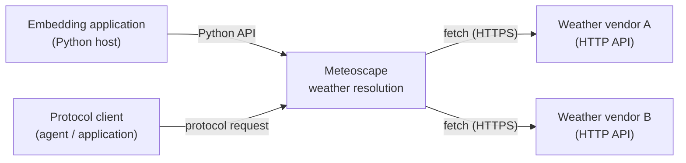
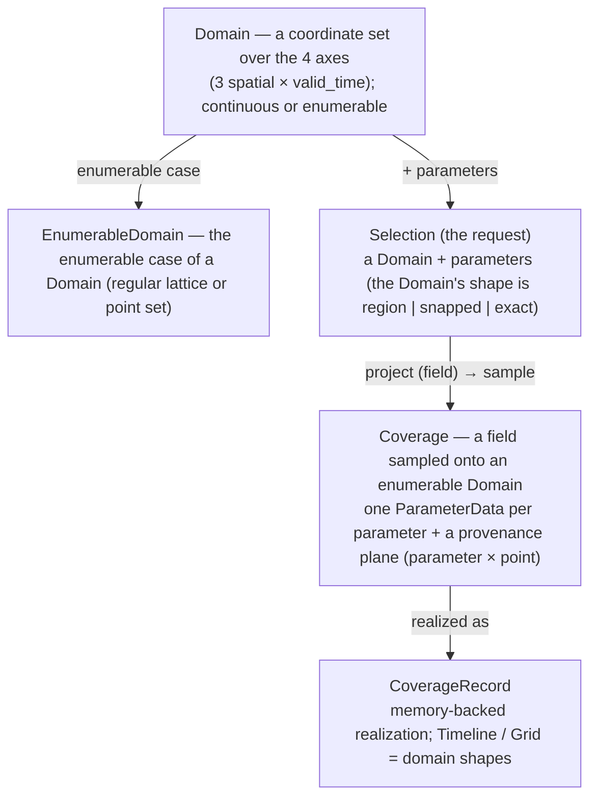
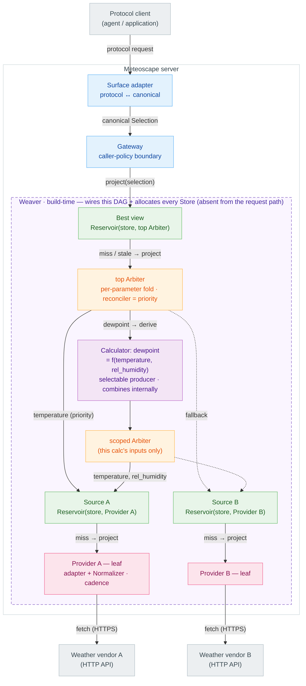

# Meteoscape · Architecture

This document captures the **high-level architecture**. See [`glossary.md`](./glossary.md) for the glossary, [`docs/adr/`](./adr) for recorded decisions, [`concerns.md`](./concerns.md) for standing concerns. Lower-level concerns are intentionally **deferred** and listed at the end.

> Scope note: everything here is at the architecture/contract level. Where a concrete shape would prematurely lock a deferred decision, we define only the *seam*.
> A fact the design depends on belongs here, but its justification goes to ADRs.
> ADRs are revisable records. A recorded rejection must state the real structural load it bears; flag arbitrary rejections rather than treat them as binding.
---

## Purpose

**Meteoscape** is a **manifold-based Coverage-resolution engine**: a recursive **Manifold** algebra that resolves a request for a field — weather over an area and time — into one normalized, provenance-stamped **Coverage** under a stated **policy/objective**. The hard problems it owns — **vendor heterogeneity** (different shapes, units, geometries), **source selection/quality**, and **freshness** — are resolved *inside* the algebra, behind one small, uniform contract. Protocol adapters expose the same engine without changing it. The **best view** (best-obtainable source + fallback) is one objective, not the definition of the engine; the same algebra supports other objectives (see [Guiding principles](#guiding-principles) and [Extension points](#extension-points)).

## Scope / non-scope

**In scope:**

- The **best view** profile — a single best-quality `Coverage` assembled over multiple providers behind one contract (one *objective*; the engine admits others).
- The supported Python **embedding surface** — use Meteoscape's weather capabilities without running
  a protocol server.
- Protocol adapters that translate between surface requests and the canonical contract.
- **Select + fallback** arbitration through the Arbiter's configurable **`reconciler` slot** ([ADR-0004](./adr/0004-producer-resolution-and-capability.md)). The implemented `priority` reconciler is a *selection-ordering* policy, which is all v1's fully-overlapping producers need. `tile`, `consensus`, and `feather` are the slot's intended generalization, but they fold **per cell** over resolved values, so they require an **interface widening**, not merely a configuration change → [#28](./concerns.md#28-reconciler-interface-selection-ordering-vs-per-cell-fold).
- The **canonical Coverage model** (`CoverageRecord` realization; Timeline / Grid are domain shapes) with **per-parameter provenance** and `expiration`-based freshness.
- The **`Store` type** as a wired-in seam (a `Writable` Manifold with private lattices).

**Structural non-scope:**

- **Not a weather model** — it serves provider data; it does not generate forecasts/NWP. Derived calculators may synthesize new parameters, but producing primary forecasts is not the product.
- **Not an accounts/billing business** — Meteoscape is not a multi-tenant billing/accounts product. Caller identity, usage monitoring, quotas, and rate limits belong to the **Gateway** policy boundary when configured.
- **No end-user UI** — the deliverable is an embeddable engine plus protocol adapters, not an
  application.

## Guiding principles

- **One recursive abstraction** — everything is a **Manifold** (a projectable space); Providers, `Store`s, Sources, the Arbiter and the "best" view differ only in their `project` logic and whether they add the `Writable` facet. `project` is closed: it returns a **Manifold** — a **field/view** until sampled; a **Coverage** is that field **sampled onto an enumerable `Domain`** (itself a Manifold). See [ADR-0001](./adr/0001-manifold-algebra-and-composition.md).
- **Cross-provider by construction** — a canonical **Coverage** model is the contract; vendors are translated only at their own edges.
- **Embedding is a first-class product surface** — Python hosts and protocol clients are both
  supported consumers. The exact Python facade and its relationship to protocol adapters and
  internal composition remain open in [concern #39](./concerns.md#39-python-embedding-surface-and-public-failures).
- **Deep modules, simple boundaries** — each component hides substantial complexity behind a small interface with a trivial test boundary.
- **Composition over inheritance** — Manifolds compose: a Source is `Reservoir(store, Provider)`; the best view is `Reservoir(store, Arbiter)`. The `Store` is one contract — a `Writable` Manifold with private lattices — used in both. Providers compose shared conversion utilities.
- **Compose for behaviour, filter for coverage** — mint a *new composed Manifold* only when children differ in **behaviour**; differences only in **which `Domain` they cover** are the **Arbiter's capability filter**, not new nodes. See [ADR-0001](./adr/0001-manifold-algebra-and-composition.md).
- **Reduction is a policy, not a special case** — the **Arbiter** decides the **selection/reduction policy**; **provider selection (the default `priority` reconciler) is one instance of Manifold reduction**, peer to `consensus` / `feather`. The architecture must not encode provider selection as a special case → [ADR-0004](./adr/0004-producer-resolution-and-capability.md).
- **The served root is a task-oriented profile** — a *composed surface tree* that **resolves a requested view into a `Coverage` on a target `Domain`** under an **objective**. The best view is one profile; comparison, consensus, and verification are peer trees rather than contract changes. Some profiles may expose **diagnostics / traces as sidecars** — the **data product stays a `Coverage`** ([#14](./concerns.md#14-resolution-trace-and-observability)). The `Reservoir` only adds **retention**; the **Arbiter** carries the **policy**.
- **Small contracts, extensible realizations** — facets are interfaces independent of concrete realizations; for example, `Store` is one `Writable` Manifold contract across transient and persisting substrates.
- **Explicit wiring, testable units** — constructor injection everywhere; a single build-time **Weaver** wires the graph (config in, root Manifold out); every module is unit-testable with mock dependencies.

## System context

Meteoscape sits between weather-consuming applications and weather-producing vendors. A Python host
may use it as an embedded library; a protocol client may use a server adapter. Both are product
surfaces. This context view deliberately leaves their internal API topology open.

- **Embedding applications** configure and call the engine through the supported Python package
  boundary, with no server process required.
- **Protocol clients** reach the product through adapters.
- **Vendors** are external HTTP weather APIs, each translated at its own Provider edge — vendor knowledge never leaks inward.
- **Translation** between a surface's protocol and canonical semantics is *not* surface-neutral, so it lives in the surface adapters; caller **policy** (identity/limits) is surface-neutral and lives in the Gateway.

## Core concepts

### Manifold — the one abstraction

Every node below the Gateway is a **Manifold** (`project(selection) -> Manifold`), differing only by `project` behaviour and the optional **`Writable`** facet (accepts `assimilate`). A node exposes **no public lattice** — its declared grids are private to its `Store` ([ADR-0006](./adr/0006-materialization-granularity-and-store-shape.md)); the only public `domain` is a materialized `Coverage`'s. The full algebra — closed projection, result countability, materialization, freshness, and composition (leaf vs composite) — is [ADR-0001](./adr/0001-manifold-algebra-and-composition.md); terms are in [`glossary.md`](./glossary.md). The three **consequences** that shape *this* level:

- **`snapped` resolves at a storing `Reservoir`, not the Arbiter** — only a node that owns a `Store` can `quantize`; the Arbiter owns no substrate. Grid-alignment is **per node and per axis**; internal nodes are handed Enumerable (store-shaped) Domains → [ADR-0002](./adr/0002-data-model.md).
- **Assembly is free; materialization is on-demand** — a projected view is a lazy field, sampled to values once at `assimilate` (storing node) or per read (non-storing leaf).
- **Two combine axes, one Arbiter** — *deriving* a parameter from others is a **Calculator**; *filling the lattice* for one parameter is a **`reconciler`**. Both are resolved by the single Arbiter shape; neither is a new node → [ADR-0004](./adr/0004-producer-resolution-and-capability.md).

### Canonical data model

- **Axes & parameters** — **4 axes: 3 spatial + `valid_time`**, all **field axes**; the Z axis carries one axis-level **`vertical_reference`**. **Parameter**, **provenance**, and **`issue_time`** are *not* axes: a parameter is a **functional** `(quantity, statistic)` identifying a **`ParameterData`** ([ADR-0002](./adr/0002-data-model.md)); provenance is a **Coverage plane over parameter × point**, and **`issue_time` (run identity) is a provenance stamp** on the atomic `Origin` → [ADR-0003](./adr/0003-provenance-and-origin.md).
- **Domain** — a **coordinate set** over the 4 axes, **continuous** or **enumerable**. The indexable **`GridDomain`** mixes axis representations: `RegularAxis` on X/Y/T, and on Z a **`VantageAxis`** aperture, point, or span cell. A **Capability** advertises a footprint (point-cell or span-cell Z); admission is the **request-side per-axis gate** `requested.matches(declared)` — containment, or **intersection** for a vantage Z aperture. Axis geometry is otherwise **pure** (resamplability is the parameter's `scale`, not an axis flag) → [ADR-0002](./adr/0002-data-model.md).
- **Coverage** — a **field sampled onto an EnumerableDomain** (`Coverage <: Manifold`): one **`ParameterData` per parameter**, a self-describing **`capability`** descriptor block, plus a **provenance plane** ("a Selection filled with data"). Parameters that cannot share its Domain (a temperature profile beside surface precipitation) are **separate Coverages**, never one padded with nodata **to force a shared geometry** (distinct from padding a short *temporal* tail, which is [#30](./concerns.md#30-response-membership-under-runtime-degraded-fallback)'s open question). The shape-agnostic exchange unit, realized as a **`CoverageRecord`** (Timeline / Grid are domain *shapes*, not classes). Slice layout, descriptor block, `present` mask, axis `Cell` `bounds`, and the canonical-mono-unit invariant → [ADR-0002](./adr/0002-data-model.md).
- **Selection** — the **one request type**: `Domain + parameters`; the Domain's **shape** (Continuous / Snapped / Enumerable) **is** the mode and *is* the output lattice when enumerable → [ADR-0002](./adr/0002-data-model.md). A surface adapter builds it at the edge.

> The best view always serves the **latest run**; cross-run (archives / multi-run combination) is a deferred seam → [Deferred decisions](#deferred-decisions).

### Normalization vs. homogenization

Two distinct alignment steps, deliberately split:

- **Provider normalization** → canonical **semantics** in **native geometry**: parameter identity, **units**, time encoding, and **presence** — the boundary at which a vendor's absent sample becomes Meteoscape **nodata** (`present[i] = False`) rather than a substituted value, so no absence enters the algebra disguised as a number → [ADR-0002](./adr/0002-data-model.md). Vendor knowledge, so it lives in the Provider — the result is a set of **native records**: one co-domained Coverage per set of parameters sharing a native Domain (grouping emergent from the Tap declarations, axis-agnostic — one record when everything shares a geometry), *semantically canonical but geometrically native*, not vendor JSON ([ADR-0006](./adr/0006-materialization-granularity-and-store-shape.md)).
- **Homogenization** → **sampling a field onto the requested EnumerableDomain** so its `ParameterData` are **conformable** (share one Domain). Purely spatial/temporal and **read-time**; **intrinsic to a storing `Reservoir`** — the two-sided write/read pipeline → [Reservoir](#reservoir). The per-axis **kernel** is deferred ([concern #5](./concerns.md#5-read-time-homogenization-fidelity)).

Rule of thumb: **units & parameter identity = Provider (write-time, in the data); spatial/temporal alignment = sampling onto the target lattice (read-time, or once at `assimilate`).**

### Failure, nodata, and availability

Three distinct outcomes, never conflated: **nodata** (a producer succeeded but has no value at a cell — `present[i] = False`; **data, a successful gap**), **`runtime-failure`** (couldn't produce — 5xx / timeout / malformed), **`capability-mismatch`** (no producer declares it). The failure-aware Arbiter contract resolves each parameter independently and **omits** any whose candidates all fault, so a partially-served request returns the **producible subset** (an unserved parameter is simply absent, never persisted). `project` stays closed — failures are not Coverage state; the **edge** derives each absent parameter's reason (capable ⇒ `runtime-failure`, else `capability-mismatch`) and raises a whole-request error only when **nothing** is produced. The implemented selection path still propagates `RuntimeFailure` for the whole request; [concern #28](./concerns.md#28-reconciler-interface-selection-ordering-vs-per-cell-fold) records the widening needed for per-candidate fall-through and partial results.

## Major components

Everything below the Gateway is one recursive shape: a **Manifold**, composed of other Manifolds. The "best" view and a Source are the *same* `Reservoir` type with different children.

*Colour: green = `Reservoir` (Best view + Sources, one type) · orange = Arbiter (top + scoped, one type) · purple = Calculator · pink = Provider · blue = edge.*

Each `Reservoir` resolves the same way: quantize to its `Store` grid and serve fresh cells; on miss/stale, `project` the (store-shaped) child, `assimilate`, then homogenize onto the request. The **dashed frame** is the **Weaver**'s build-time product. The **dewpoint Calculator** illustrates a derived parameter as just another selectable producer the top Arbiter picks — its formula runs behind its own scoped Arbiter over the same Sources, keeping the graph an acyclic DAG → [ADR-0004](./adr/0004-producer-resolution-and-capability.md).

A **shared kernel** underpins all of the above (off-diagram): the **Coverage model**, the **conversion library + Normalizer protocol**, the **error taxonomy**, **typed config + secrets injection**, the **catalogues + binders**, the **Weaver**, and the **composition root**.

### Reservoir

A read-only Manifold composed of a **`Store` (a `Writable` Manifold) + one child**. Its **public shape is its forwarded `capability`** (the child's declared footprint); the `Store`'s lattices are **private** retention layout ([ADR-0006](./adr/0006-materialization-granularity-and-store-shape.md)). `project` runs one pipeline: **`quantize`** the request onto the `Store` lattices — **per axis**: snap where a lattice is declared **and widen outward to whole assimilable units** (for example, a parameter's timeline at a spatial cell), identity where none is (for example, Z — the cell joins the unit key), and **`ANY` where the unit spans the axis wholly** (widening carried to its limit — the timeline store asks `ANY` on `T` and `Z`), so the retrieval shape **encloses** the request — then read the `Store`'s per-unit **{held, fresh, origin}** report (held cells matched with the same cell arithmetic as `serves`; **held** is the `Store`'s own `capability`, **fresh** is `expiration > now` off each `ParameterData`'s provenance `summary` — the algebra needs no `is_current` operation, [ADR-0001](./adr/0001-manifold-algebra-and-composition.md)); serve when the covered units are **fresh and single-origin**, else **refetch the missing/stale parameters whole** from the child in **one** call (`child.project(store_shape)` — asking per parameter group would multiply vendor fetches) and `assimilate` the answer — a write **replaces whole units**, never partly overwrites one. Finally **homogenize** the stored units **onto `sel.domain`** — a **crop** when the request rides the grid, a sample when it's off-grid ([read-back S](#normalization-vs-homogenization)); for a Source this read-back is also the **fact→product boundary**: matched native cells are relabeled onto the request's Z cell, *below* the Arbiter, so every answer the Arbiter folds is already conformable. Instantiated twice, differing only by child:

- **Source** = `Reservoir(store, Provider)` (holds a provider's Coverages).
- **Best view** = `Reservoir(store, Arbiter)` — a **task-oriented profile** that resolves the most suitable `Coverage` for a request under a policy/objective.

It adds retention, not arbitration — **selection** lives in the Arbiter it wraps. Residual-selection and freshness mechanics: [ADR-0001](./adr/0001-manifold-algebra-and-composition.md), [ADR-0003](./adr/0003-provenance-and-origin.md).

**Roles:** `Store` = unit holder + `quantize`/report, child/Provider = gap-filler, **`Reservoir` = serve-vs-refetch policy + read-back homogenization** (homogenization is *not* leaf-only). **Partial refill is spatial / per-unit**: a request reuses its fresh enclosing units and refetches only the missing ones, each **whole**. A unit's **`valid_time` window is therefore single-origin** — **combining origins is the Arbiter's reconciler, never the `Reservoir`'s** (same-run spatial fusion stays `Uniform`, [ADR-0003](./adr/0003-provenance-and-origin.md)) — so a Reservoir never temporally splices. Nearest-neighbor is the **degenerate read-back kernel**; **per-kind / higher-order** kernels and a provider **`exact`** off-grid capability are separate extensions ([concern #5](./concerns.md#5-read-time-homogenization-fidelity)).

### Arbiter

The **producer-resolution composite** the best view turns to — a **reducing Manifold**, the one core node with **no substrate** of its own, that **decides the selection/reduction policy**. It is constructed as **`Arbiter(producers, reconciler, scope=None)`**: a sequence of **`Producer{node, key}`** candidates (Sources and Calculators) plus a first-class **`Reconciler`** built by `build_reconciler(ArbiterPolicy, SourceRegistry, CalculatorRegistry)`. **`scope`** is the parameter set this Arbiter resolves — omitted at the top (every parameter its producers declare), and a Calculator's **inputs** at a scoped one, since a scoped resolver receives whole producers and must not declare parameters its Calculator never consumes → [ADR-0007](./adr/0007-capability-carries-its-domain.md). Per **parameter** it orders candidates with its **`reconciler`**, admits by `serves`, projects the winning producer, then assembles the per-parameter `ParameterData` into one Coverage record (spanning nodes via `PerParameter` when winners differ); the default `priority` reconciler provides **best-source selection** (ranking reads the reconciler's `ProducerKey → int` lookup, flattened from both registries). Generalizing the slot to a per-cell `consensus` / `feather` **fold** is a deferred interface widening → [#28](./concerns.md#28-reconciler-interface-selection-ordering-vs-per-cell-fold). Capability matching, reconciler catalogue, and Calculator topology → [ADR-0004](./adr/0004-producer-resolution-and-capability.md).

### Source

A `Reservoir(store, Provider)` — the serve-or-fetch view of one provider's data; a **role, not a distinct type**. It **forwards** its Provider's **`Capability`** to the Arbiter unchanged (retention adds no capability; the `Store` grid is a fidelity floor, not a boundary) — which is what lets it **admit uncached-but-in-footprint requests**: admission reads the forwarded footprint, store contents only drive the serve-vs-refetch split inside `project`. Its Provider returns native records already carrying full **Provider-authored provenance**; the Source asks the Provider **store-shaped** — one call, `ANY` on the axes its unit spans wholly — so the answer arrives **multi-domain** and its `assimilate` stores the records as **identity** (no resampling, no stamping).

### Provider (leaf Manifold)

A vendor-specific **leaf** Manifold that **contributes native, normalized `Coverage`s into the graph**: adapter (auth / HTTP / endpoints) + its **Normalizer** + capability/cadence/grid declarations. No storage, no children, stateless. It **authors the Coverage's provenance** at fetch — a single-fetch `Uniform` plane, stamping the run `issue_time` and deriving `expiration` from its **cadence** (`CadenceDef`, [ADR-0003](./adr/0003-provenance-and-origin.md)) — and passes that `Provenance` into the Normalizer. The Normalizer maps vendor shape → canonical **semantics** in **native** geometry (not the request Domain; homogenization is the Reservoir's), emitting **native records** grouped by shared native Domain ([ADR-0006](./adr/0006-materialization-granularity-and-store-shape.md)). `project` dispatches to the matching vendor endpoint by requested `Domain`. A vendor-declared native lattice is a **build-time declaration** handed to the `StoreFactory` at weave, not a request-path facet.

### Embedding surface

The supported Python-facing product boundary. It lets a host application use Meteoscape's weather
capabilities and handle documented outcomes without starting MCP, HTTP, or any other server. This is
a product commitment, not yet an API or wiring decision.

The exact facade, exported types, lifecycle, failure model, configuration experience, and
relationship to protocol adapters and the internal graph remain to be settled in
[concern #39](./concerns.md#39-python-embedding-surface-and-public-failures). No existing internal
type becomes public merely because it might participate in an eventual implementation.

### Gateway — caller-policy boundary

The surface-neutral **caller-policy boundary**: it applies caller policy (authz, rate-limit, quota, or pass-through) then calls `project` on the served profile root and returns a **Coverage** (runtime-checked; a non-Coverage result is a bug). It is the one **surface-neutral policy seam** — uniform identity/limits across all surfaces — and is **not** a Manifold (it can reject/throttle; it does not project). Projection-shaped cross-cutting (response caching, metrics) stays in the Manifold algebra, not the Gateway. Surfaces serialize the Coverage; they do not sample.

### Store — one type, several positions

A single `Store` contract — a **`Writable` Manifold**, the only thing you can `assimilate` into; implementations vary by substrate, persistence, and lattice structure behind one write/report/read face. The same contract serves several jobs by what it's handed: **inside each Source** (provider native records — the landing layer), **inside the best view** (reduced, request-shaped Coverages — the curated layer), and **wrapping a heavy Calculator** (opt-in). It is **unit-granular, never co-domained** ([ADR-0006](./adr/0006-materialization-granularity-and-store-shape.md)): `assimilate` consumes the producer's (possibly multi-domain) answer and **samples it into per-parameter units** (`(parameter, per-axis cells, window)`; for example, a parameter's timeline at a spatial cell), **replacing each atomically** — a unit carries one origin, never a partial overwrite. The store does that slicing because only it holds both halves of each unit's `Selection`: `X/Y`+`T` from its private lattice, the native cell from the answer. Its lattices are **per axis and private** — the `quantize` / report / read-back target, a **fidelity floor** that off-grid reads homogenize from; axes without a declared lattice pass through `quantize` identity, their cells joining the unit key. Every `Store` is **allocated by the Weaver** via an injected **`StoreFactory`**, provisioned from either a **provider-exact** lattice declaration (build-time construction face) or a **`StoreSpec`** configured guess (`spatial_step` + retention).

### Config, binders, Weaver

Build-time composition — deployment settings → catalogues → binders → `ProfileDef` → woven DAG — is
owned by [ADR-0005](./adr/0005-build-time-composition.md) (manifests, binder mechanics, rationale,
rejected splits); this section fixes the roles.

- **Catalogues** — three process-wide code maps (`ProviderCatalog`, `CalculatorCatalog`,
  `ParameterTable`); a plugin **manifest** keeps declarations and construction together (geometry and
  canonical `ParameterDef`s stay off it — Capability + `ParameterTable` own those). Catalogue is an
  architectural role, not a directory rule; secrets are an injected map, not a catalogue.
- **`ProfileConfig`** (operator, per profile) — `OfferingDef` declarations, `CalculatorDef`s,
  root `StoreSpec`, and `ArbiterPolicy`. Offering names are explicit; catalogue validation occurs
  during composition.
  Sources whose provider declares no native lattice carry their own `StoreSpec` (configured guess);
  a provider-declared lattice reaches the factory through the build-time construction face. Same
  knobs shape everywhere; separate instances per store position.
- **Binders** — symmetrical: `SourceBinder` → `SourceRegistry`, `CalculatorBinder` →
  `CalculatorRegistry` — catalog-resolved build products, not live Calculators. `SourceKey` is derived
  at build, never authored on an `OfferingDef` ([ADR-0003](./adr/0003-provenance-and-origin.md)).
- **`ProfileDef`** — weave input: both registries + root store + arbiter; a constrained composition
  language over the fixed node family, not a freeform DAG DSL. Profile-root lattice is **separate**
  from Source lattices.
- **Weaver** — `Weaver(stores: StoreFactory).weave(profile: ProfileDef) → Manifold` (concretely the best-view `Reservoir`, but the seam promises only the algebra: root retention is a `root_store` config fact, not a contract); allocates every
  `Store` via `stores.create`, wraps each source and calculator node as a **`Producer{node, key}`**,
  constructs the **`Reconciler`** via `build_reconciler(ArbiterPolicy, SourceRegistry,
  CalculatorRegistry)`, builds `Arbiter(producers, reconciler)`, wraps the best-view `Reservoir`,
  steps out. Holds no catalogue; **does not interpret priority** (that is the reconciler).
  `Producer` unification + memoized Calculator wiring →
  [ADR-0004](./adr/0004-producer-resolution-and-capability.md).
- **Composition root** — `server.py`: `compose(profile, providers, calculators, secrets, clock, stores) → Gateway`
  is the fixed call sequence (binders → `ProfileDef` → `weave` → Gateway). **No ordering or construction
  logic of its own.** `weave`'s first step is **`validate_calculators`** — reading only the `ProfileDef`,
  it rejects a graph whose Calculator inputs are unproducible (or whose calculators cycle) *before* any
  `Store` is allocated, since declaring a Calculator is a promise the composition must be able to keep.
  As the Weaver's precondition it runs on every weave path, so no caller can forget it. **Geometry needs no pass of its own** —
  each node's `Capability` composes its `Domain` as the graph is built, so an unresolvable one fails at
  weave ([ADR-0007](./adr/0007-capability-carries-its-domain.md)), and the surface reads the profile's
  Reach off the woven root. Catalogues are module-level data;
  `Settings` projects `ProfileConfig` in `main()`. Build-time failures are **`CompositionError`**
  (binders / Arbiter policy / composition well-formedness), distinct from the request-path taxonomy in
  `errors.py`.

## Contract surfaces

Every seam in one place — the *promise* only; behaviour and rationale are in Major components above.

- **Embedding surface** — supported Python invocation, result, and failure contract; usable without
  a protocol server. Its exact facade and implementation relationship to other surfaces are
  [#39](./concerns.md#39-python-embedding-surface-and-public-failures).
- **Manifold** — `project(Selection) -> Manifold` (closed, read-only — a field/view). Closure is **shape-correspondence**: the answer mirrors the question's shape — a **fully enumerable** Selection samples to a `Coverage` co-domained on `sel.domain`, while an axis left **`ANY`** is answered at the producer's **native** cells, so an `ANY`-bearing multi-parameter Selection may be answered **multi-domain** ([ADR-0001](./adr/0001-manifold-algebra-and-composition.md)). `assimilate(answer)` on `Writable` (samples the producer's answer into whole quantized units, **replacing each atomically**); `domain` (an enumerable `Domain`) only on a materialized **`Coverage`** (the positional grid, derived from its `capability`).
- **Selection** — `Domain + parameters`; the Domain's **shape** is Continuous (`region`) / Snapped / Enumerable (`exact`) ([ADR-0002](./adr/0002-data-model.md)); a lattice is an **enumerable Domain** (no separate structure layer); Snapped requires a storing target.
- **Capability** — a **base `Manifold` member, the dual of `project`**: `serves(parameter, requested)` + the served `parameters` (`ParameterId → ParameterDef`), plus the per-parameter **`Domain` it serves** (`reach(parameter)`) — a Manifold's **Reach**, composed by every form, never synthesized → [ADR-0007](./adr/0007-capability-carries-its-domain.md). `serves` remains the sole **admission authority**; it reads the same geometry but may tighten below it (resampler-reachability, probed availability), so the two are not merged. The leaf/composite family, the closure of emitted functionals, and the `serves` matching predicate → [ADR-0004](./adr/0004-producer-resolution-and-capability.md).
- **Reach** — a **Manifold's** per-parameter `Domain`, published by its `Capability`; the profile's Reach is the woven root's, a Calculator's input Reach its scoped Arbiter's. **Tight, not merely inner**: composition returns the dominating child's `Domain` (or the one contained in all, at a Calculator) or **raises**, so any profile that composes serves exactly what it publishes — and a clock-anchored `RollingAxis` stays live because the object is the producer's own. Composition belongs to the **`reconciler`** (v1 `priority`: dominance, else `CompositionError` naming the conflicting producers and axis). Membership is the served **parameter set** — a parameter no enabled producer serves is simply absent (graceful degrade). Dominance is per-axis **extent containment**, never `Domain.matches` (the admission predicate, which `VantageAxis` specialises to intersection). Cross-parameter folding is the **surface's**, per product → [ADR-0007](./adr/0007-capability-carries-its-domain.md), [#29](./concerns.md#29-narrated-reach-what-a-profile-promises).
- **Provider / Normalizer** — `project(Selection) -> Manifold` + `capability` + `source_key` — its declared geometry is published by its `Capability` ([ADR-0007](./adr/0007-capability-carries-its-domain.md)), not by a second accessor; carries full Provider-authored provenance. Asked with **`ANY`** on the axes its Source's unit spans wholly, it answers **multi-domain** — the **native records** the Normalizer emits, grouped by shared native Domain, reaching the store un-flattened ([ADR-0006](./adr/0006-materialization-granularity-and-store-shape.md)). Asked a fully enumerable Selection it samples to one co-domained `Coverage`, like any Manifold. Capability (with the geometry it publishes), cadence and grid are **declarations** — members it publishes, never arguments to `project`.
- **Gateway** — `canonical request -> Coverage | reject` (served profiles always resolve to a Coverage; the surface only serializes); not a Manifold itself. Runtime-checks the root's `project` result is a Coverage (bug → non-taxonomy error).
- **Surface adapter** — `protocol ↔ canonical`; exposes the same Coverage-resolution engine through any supported protocol. Builds the Selection's `Domain` and resolves the output lattice / default resolution at the edge, and desugars parameter **aliases** to functionals `(quantity, statistic)` → [ADR-0002](./adr/0002-data-model.md).
- **Error taxonomy** — `capability-mismatch | runtime-failure | bad-request`; adapters map to protocol errors. Distinct from successful **nodata**; partial success is the norm → [Failure, nodata, and availability](#failure-nodata-and-availability).
- **Typed config** — catalogues (provider / calculator / parameter) + secrets + `ProfileConfig`
  (`OfferingDef`s, `CalculatorDef`s, root store, arbiter) → `SourceRegistry` + `CalculatorRegistry` →
  `ProfileDef`.

## Data / request flow

1. **Surface adapter** (e.g. `mcp_app`) receives a tool call → translates it into a canonical **Selection** (`Domain + parameters`, where the Domain's shape carries the mode), choosing the output lattice / default resolution at the edge → hands it to the **Gateway**.
2. **Gateway** applies its configured caller policy and calls `project(selection)` on the **best view**.
3. **Best view** (`Reservoir`) — quantizes the request onto its `Store`'s private lattices (its **canonical lattice**; identity on Z — the request's Z cell joins the unit key) and serves fresh units; for any parameters missing or **stale** it `project`s the **store-shaped** missing units on its child, the **Arbiter**, `assimilate`s them whole, then **homogenizes the stored units onto the request**.
4. **Arbiter** `project` does the **per-parameter** split: per parameter it takes the reconciler's candidate order, admits by capability, and projects the **first admitted** producer whole, then assembles the per-parameter `ParameterData` into one (Coverage-shaped) **view** — including multi-node assembly via `PerParameter` when winners span more than one producer. A `RuntimeFailure` currently fails the whole request; per-candidate fall-through and per-parameter partial success require the widening in [concern #28](./concerns.md#28-reconciler-interface-selection-ordering-vs-per-cell-fold).
5. **Source** (`Reservoir`) checks its `Store` then `project`s its **Provider** **once** on the **store-shaped** residual (`ANY` on the axes its unit spans wholly); the Provider answers **multi-domain** with native records, which the `Store` slices per parameter and stores as identity; the Source's read-back relabels the matched native cells onto the handed shape.
6. Results are `assimilate`d into the `Store`s — the **materialization boundary** (sample the field onto the node grid, store it).
7. The best view returns the assembled multi-parameter **view** (assembly is just projection over the populated space).
8. **Gateway** returns the **Coverage**; the **surface adapter** shapes it for its protocol (serialize only).

## Extension points

Optional extensions supported by the algebra's existing seams; some require a narrower interface
widening at that seam:

- **Task-oriented profiles** — served roots beyond the best view, each a **composed surface tree** under an objective: **provider comparison**, **consensus / blended** realizations, **verification / skill scoring**, **uncertainty products**, and **decision-oriented products**.
- **Persisting `Store`** — a persisting implementation of the `Store` type.
- **Higher-order homogenization kernels / provider `exact`** — nearest-neighbor is the degenerate kernel; higher-order kernels, accuracy bounds, and a provider **`exact`** capability (true off-grid points bypassing the store-grid floor) extend it → [concern #5](./concerns.md#5-read-time-homogenization-fidelity).
- **Materializing any Manifold** — calc `Store`s, per-surface views.
- **Synthetic Manifolds (Calculators)** — derived parameters as selectable producers; topology, scoped Arbiters, and Weaver memoization → [ADR-0004](./adr/0004-producer-resolution-and-capability.md), composition → [ADR-0001](./adr/0001-manifold-algebra-and-composition.md).
- **Coverage `reconciler`s** — `tile` / `consensus` / `feather` beyond the default `priority`; radar / regional mosaicking and **obs + forecast along `valid_time`** are this one shape → [ADR-0004](./adr/0004-producer-resolution-and-capability.md).
- **Observation + forecast** — obs and forecast as **separate** `Reservoir`s, folded by the Arbiter's `valid_time` reconciler.
- **Grid domain shape** — spatial-axis Coverage alongside the Timeline shape.
- **Background plane** — scheduler + enrichers feeding synthetic Sources.
- **Per-point provenance** — geometry-aligned, additive.
- **Run-collection / archive layer** — a collection of **run-stamped** Coverages keyed by categorical keys (`issue_time`, ensemble, scenario); the home of cross-run combination and forecast-convergence views → [ADR-0004](./adr/0004-producer-resolution-and-capability.md).

## Deferred decisions

These decisions have defined seams but no fixed policy:

- **Cross-run combination** — multiple forecast runs for one parameter; an atomic `ParameterData` is
  **single-origin**. The reconciler / run-keyed-collection seam →
  [ADR-0004](./adr/0004-producer-resolution-and-capability.md).
- **Usage monitoring / quotas / rate-limits (Gateway policy)** — caller identity, vendor-API usage metering, quotas, and rate limiting are policies behind the **Gateway seam**; a pass-through policy and enforcing policies share the same boundary → [Gateway](#gateway--caller-policy-boundary).
- **Explicit / dynamic quality** — quality is implicit in Arbiter ordering; a real scoring policy (e.g. request-area resolution) can replace the static order behind the same selection signature.
- **Incremental recompute of synthetic `ParameterData`** — refresh is whole-`ParameterData`; partial recompute is an unmodeled optimization (see [ADR-0003](./adr/0003-provenance-and-origin.md)).
- **Parameter conventions** — canonical names, units, and spatial-reference encoding are catalogued in [`parameters.md`](./parameters.md); the wider convention remains separate from the data-model structure.
- **Concrete providers, deployment, and protocol-specific tools** — these instantiate the architecture without extending its contract.

## Risks / open questions

Open concerns live, **priority-ordered**, in [`docs/concerns.md`](./concerns.md); this is the index.

- **[5. Read-time homogenization fidelity](./concerns.md#5-read-time-homogenization-fidelity)** · **[21. `serves` extent vs `project` crop-ability](./concerns.md#21-serves-extent-vs-project-crop-ability)** · **[15. Coarser-grid resampling and aggregation semantics](./concerns.md#15-coarser-grid-resampling-and-aggregation-semantics)** · **[6. Reconciler catalogue](./concerns.md#6-reconciler-catalogue)** · **[13. Candidate admission: containment vs intersection](./concerns.md#13-candidate-admission-containment-vs-intersection)** — Z admission uses request-side `intersects`; layer-selection divergence remains open · **[9. Cross-run combination](./concerns.md#9-cross-run-combination)**.
- **[7. Quality scoring](./concerns.md#7-quality-scoring)** · **[8. Arbiter to Broker pressure](./concerns.md#8-arbiter-to-broker-pressure)** · **[10. Parameter conventions](./concerns.md#10-parameter-conventions)** · **[14. Resolution trace and observability](./concerns.md#14-resolution-trace-and-observability)** · **[36. Unserved and uncomparable are indistinguishable](./concerns.md#36-unserved-and-uncomparable-are-indistinguishable)** — a skip reason code, not a predicate change.
- **[18. Clock-anchored footprint fidelity](./concerns.md#18-clock-anchored-footprint-fidelity)** — per-provider cadence numbers remain open. · **[11. Incremental synthetic recompute](./concerns.md#11-incremental-synthetic-recompute)** · **[12. Curvilinear domains](./concerns.md#12-curvilinear-domains)** · **[22. Lattice helpers vs domain/sampling split](./concerns.md#22-lattice-helpers-vs-domain--sampling-module-split)** · **[23. Spatial vs temporal RegularAxis types](./concerns.md#23-spatial-vs-temporal-regularaxis-types)**.
- **[20. Provider multi-resolution offerings](./concerns.md#20-provider-multi-resolution-offerings-offering-aware-selection)** · **[25. Root-store unit reuse across vantage windows](./concerns.md#25-root-store-unit-reuse-across-vantage-windows)** · **[26. Provider / calculator plugin scaffolding](./concerns.md#26-provider--calculator-plugin-scaffolding)** · **[27. Stored-calculator store binding](./concerns.md#27-stored-calculator-store-binding)** · **[28. Reconciler interface: selection-ordering vs per-cell fold](./concerns.md#28-reconciler-interface-selection-ordering-vs-per-cell-fold)** · **[29. Narrated reach: what a profile promises](./concerns.md#29-narrated-reach-what-a-profile-promises)** · **[30. Response membership under runtime-degraded fallback](./concerns.md#30-response-membership-under-runtime-degraded-fallback)** · **[31. Positional alignment is asserted, never checked](./concerns.md#31-positional-alignment-is-asserted-never-checked)** · **[32. Footprint-aware ranking inside the algebra](./concerns.md#32-footprint-aware-ranking-inside-the-algebra)** · **[33. Reconciler owns domain composition](./concerns.md#33-reconciler-owns-domain-composition)** · **[34. Producer-DAG walking is duplicated](./concerns.md#34-producer-dag-walking-is-duplicated)** · **[35. Calculator satisfiability vs optional-provider degrade](./concerns.md#35-calculator-satisfiability-vs-optional-provider-degrade)**.

## ADR index

- [ADR-0001](./adr/0001-manifold-algebra-and-composition.md) — Manifold algebra & composition: one closed, logically read-only `project`; capabilities not subtypes; result shape is the Selection's `Domain` cardinality; leaf vs composite, compose for behaviour, lazy fields.
- [ADR-0002](./adr/0002-data-model.md) — Data model: `Domain` one interface with swappable representations (separability a facet, regularity a per-axis `RegularAxis`, mode folded into shape, `issue_time` a provenance stamp not an axis — 4 axes); positional `Coverage` / `ParameterData` (pure `values` / `present` mask, a self-describing `capability` descriptor block, axis `Cell` `bounds`, canonical-mono-unit interior); the parameter functional model (quantity + `extent_scaling` intensive/extensive, `CellStatistic`, extent on the Domain).
- [ADR-0003](./adr/0003-provenance-and-origin.md) — Provenance is per-parameter; origin may be atomic or synthetic; realized as a `ProvenanceField` (`Uniform` / `PerParameter` / `PerPoint`, O(1) `summary`) so per-point is additive.
- [ADR-0004](./adr/0004-producer-resolution-and-capability.md) — Producer resolution & capability: one Arbiter shape; Capability = a per-parameter `(ParameterDef, Domain)` mapping + an `extent_scaling`-branched `serves` predicate; the coverage axis is a `reconciler` (default `priority` = selection); a Calculator is a selectable producer with its own scoped Arbiter; static wired DAG, only `Store`s hold state.
- [ADR-0005](./adr/0005-build-time-composition.md) — Build-time composition: deployment settings, cohesive plugin catalogues, symmetrical binders (`SourceBinder` / `CalculatorBinder` → `SourceRegistry` / `CalculatorRegistry`), `ProfileDef`, and DAG weaving; runtime nodes perform no catalogue lookup.
- [ADR-0006](./adr/0006-materialization-granularity-and-store-shape.md) — Materialization granularity & store shape: native records grouped by shared native Domain; co-domain an exchange-record invariant only; unit-granular stores with per-axis lattice-or-identity `quantize`; the fact→product boundary at Source read-back; nodes are not `Countable` (`domain` lives only on the Coverage).
- [ADR-0007](./adr/0007-capability-carries-its-domain.md) — **Capability carries its domain**: `reach(parameter)` on the interface, so a Manifold's **Reach** is its capability's Domain and the profile's is the root's. **Tight, not merely inner** — composition (owned by the `reconciler`) returns an existing child `Domain` or raises, so a profile that composes serves exactly what it publishes. Per-parameter always; cross-parameter folding is the surface's. `serves` stays the admission authority and may tighten below declared geometry.

---

## Module layout

The implementation-level module layout lives in [`module-layout.md`](./module-layout.md).
